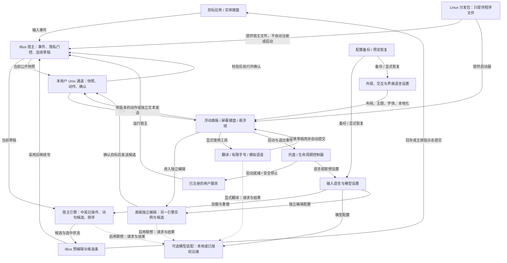
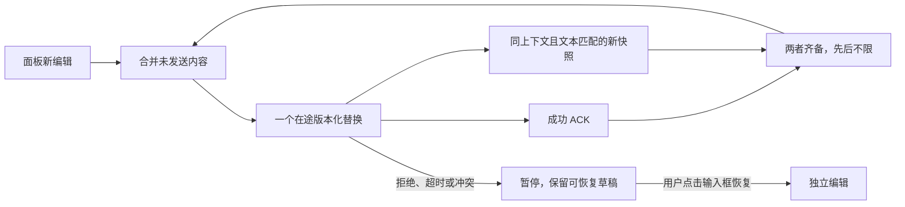

# Suzaku 当前功能链路网络

快照日期：2026-09-13。范围：**0.5.6 源码**，以 Linux / IBus 为核心。
审计基线提交：`a0c8dbf20fec8cf974cffddaf8026f902387ac04`（`0.5.5`）。
基线上叠加的 Compose/死键处理、英文补全改进、首轮链路修复和 Clippy 清理已纳入 0.5.6；
下表保留「开发」标记以区分相对 0.5.5 的变化，不表示已有可下载安装包。
这不是本机正在运行的安装版清单，也不是逐函数调用图、网络端口扫描或完成率统计。

共枚举 **8 个功能域、56 条链路（F01–F56）**。每条记录入口、处理路径、结果、
失败边界及源码依据。一个链路可能跨多个模块，一个模块也可能服务多个链路。

后续实测：[第一轮链路审计与修复（2026-09-13）][audit] 的 4 个问题（N01–N04）
已纳入 0.5.6 并加入回归；未改动本机安装。「接通」仍不代表未覆盖场景也已通过验收。

## 1. 先看整体

最核心的闭环是：**输入事件 → 连续草稿 → 本地候选 → 可选模型补充 → 采用后继续写 / 明确提交**。
面板是原生输入的伴随界面，同时保留独立编辑路径；工具结果先回到草稿，不直接视为提交成功。

下图是逻辑路由，不表示全部函数调用。实线表示已实现的路径，虚线表示需要启用或显式触发的模型请求。
同一引擎/模型代码可以在不同进程实例化，不代表面板和宿主共享一份内存状态。
可单独编辑或导入的图源见 [functional-network.mmd](functional-network.mmd)。

状态含义：

- **接通**：源码具有入口到结果/明确失败的处理路径，不等于所有桌面兼容或生产稳定。
- **开发**：审计时工作区新增/增强，现纳入 0.5.6 源码，不能当作 0.5.5 安装包的行为。
- **受限**：路径存在，但词库、识别器、外部模型或平台验收存在明确限制。
- **实验 / 预留**：接口、原型或其他平台代码存在，不能计作 Linux 主线可用能力。

## 2. 功能链路逐项枚举

### A. 启动、激活、退出与诊断（F01–F07）

| ID | 入口 → 处理 → 结果 | 失败 / 边界 | 状态与源码 |
| --- | --- | --- | --- |
| F01 | 启动面板 → 运行锁、单实例检查 → 创建窗口；重复启动向已有实例发显示请求 | 不重复建立托盘和编辑状态；启动失败不能宣称已有实例已显示 | 接通：[面板入口][panel]、[单实例][instance] |
| F02 | 面板启动 → 后台生命周期控制器 → 启动已注册用户服务、探测实际就绪 | 不自动注册缺失服务，不切走当前输入法；不管理独立启动的自定义宿主 | 接通：[托盘][tray]、[服务控制][service] |
| F03 | 托盘「激活」 → 确保宿主就绪 → 记住当前输入法 → 切换并读回确认 | 超时仍保留恢复目标；重复激活不把 Suzaku 自身记作恢复项 | 接通：[激活控制][activation] |
| F04 | 托盘「释放」 → 检查实际当前输入法 → 恢复此前观察到的输入法 | 用户已经手动切走时尊重该选择；释放不停止面板/服务 | 接通：[激活控制][activation] |
| F05 | 隐藏、关闭到托盘、收成球 → 窗口状态变化 → 宿主继续工作 | 没有可用托盘图标时，关闭唯一窗口走完整退出，不留下不可访问的界面 | 接通：[面板事件][panel]、[窗口管理][windowing]、[托盘][tray] |
| F06 | 完整退出 → 恢复输入法 → 停止受管宿主 → 清理工作线程与窗口 | 无法确认安全恢复目标、恢复/停止失败则保留界面报错；不重启 IBus，不更改锁定键/键盘布局 | 接通：[激活控制][activation]、[服务控制][service] |
| F07 | `linux-register status/verify/diag`、宿主报告、面板状态 → 检查注册/运行可见性/服务 → 分层诊断 | 只有注册文件不等于正在可用；UI 使用缓存与后台刷新，报告型程序不等于原生宿主 | 接通：[维护入口][tool]、[状态缓存][status-cache]、[运行报告][runtime-report] |

### B. 原生键盘、连续草稿与提交（F08–F14）

| ID | 入口 → 处理 → 结果 | 失败 / 边界 | 状态与源码 |
| --- | --- | --- | --- |
| F08 | IBus 焦点与按键事件 → 输入用途、修饰键、活动引擎检查 → 交给草稿或交还应用 | 密码/PIN/数字/小数/电话用途绕过组合；系统快捷键不当作候选键；依赖应用正确声明输入用途 | 接通：[IBus 桥][ibus] |
| F09 | 死键 / Compose 序列 → 当前引擎的组合状态 → 完整可打印 UTF-8 结果进入草稿 | 未完成序列不进入模型；Esc/Backspace 先取消序列；缺失表、超限/控制字符不伪造结果；支持范围不是所有布局 | 开发：[Compose][compose]、[构建依赖][build]、[隔离夹具][compose-fixture] |
| F10 | 普通字母/合法字符 → 保留原始拼写的草稿 → 本地候选立即更新 | 草稿中的空格/标点不提交；未明确选中候选时空格不强制改词；草稿外非起笔标点交还应用 | 接通：[IBus 桥][ibus]、[宿主会话][host] |
| F11 | Tab/方向键/翻页选中 → 1–6 或 Shift+Enter 采用 → 替换草稿继续写；显式选中后 Space 采用并加空格 | 数字键是当前页槽位；无候选的槽位不偷偷插入数字；Alt+数字/小键盘用于字面数字；Shift/AltGr 尊重布局解析结果 | 接通：[IBus 桥][ibus]、[补全读取与锁定][core] |
| F12 | 立即 Backspace → 撤回最近一次补全；普通 Backspace → 删末尾字符；英语 Ctrl+Backspace → 删末尾空白分隔词；Esc → 清稿 | 补全撤回是一步且受后续编辑/选择影响；不是任意历史撤销，也不撤销目标应用已经接收的文本 | 接通：[IBus 桥][ibus] |
| F13 | Enter / 候选主按钮点击 → 选中完整候选载荷 → IBus CommitText → 清草稿与显示 | 权重、词句角标、AI 标签不写进正文；普通候选采用不是提交；开发版对已接受的纯空格草稿也能无损提交，见 [N03][audit] | 接通＋开发：[IBus 桥][ibus]、[宿主提交][host] |
| F14 | 焦点、语言、隐私、Reset/停用边界 → 清理所属草稿/会话与异步结果 → 新字段重新开始 | FocusOut 迟到/缺失也不能把旧字段带入新字段；PRIVATE 允许本地候选，但禁止联想与公开镜像；模型重载与语言切换的清理范围不同 | 接通：[IBus 桥][ibus]、[宿主设置边界][host]、[原生镜像][native-sync] |

### C. 语言、词句候选与排序（F15–F21）

| ID | 入口 → 处理 → 结果 | 失败 / 边界 | 状态与源码 |
| --- | --- | --- | --- |
| F15 | 输入语言选择 → `BuiltinLanguage` / `LanguageRegistry` → 英文、简体拼音、日文罗马音插件 | 输入语言独立于 UI 和翻译语言；别名归一；插件接口存在不代表任意新语言自动可用 | 接通：[语言注册][languages]、[引擎插件接口][core] |
| F16 | 英文自然词前缀 → 有限词库索引、大小写与撇号匹配 → 补完当前词 | 保留原文；不拆开 URL/标识符/混合词做强制纠错；直/弯撇号一致性是工作区增强 | 接通＋开发：[英语][english]、[内置词库][lexicon] |
| F17 | 英文多词草稿 / 尾随空格 → 匹配较长上下文、搭配和短句 → 同时给词与句子续写 | 会话已提交片段只辅助排序，不重复输出；固定搭配不是通用语法分析；`how can I ` 优先 `help` 等为本轮开发改进 | 开发、词库受限：[英语][english]、[质量回归][english-quality] |
| F18 | 拼音、声调形式、音节边界或已转换前缀 → 有限词表与末音节补全 → 汉字词句候选和原文 | 非完整长句转换/个人词库；未知输入保留字面回退；原生声调数字须遵守 F11 的字面数字路径 | 受限：[中文插件][chinese] |
| F19 | 罗马音 → 平假名转换、有限词表/词尾补全 → 汉字/假名/片假名及原文候选 | 处理促音、小假名、拨音等规则，但没有完整日文形态分析器 | 受限：[日文插件][japanese] |
| F20 | 各类本地候选 → Literal / Word / Sentence 分类、去重、权重排序 → IBus 最多 12 项、每页 6 项及类型/来源角标 | 英语原文与最佳本地补全保留位置；CJK 转换优先且原文可选；权重不是统计置信度；其他宿主不自动套用 IBus 混排策略 | 接通：[候选混排][mix]、[引擎][core]、[显示规则][candidate-doc] |
| F21 | 信号参数 / 输入源枚举 → 置信度、降级与确认门控 → 提交结果或需确认提示；引擎可撤回内存提交记录 | 核心与演示路径存在；`GazeDwell` / `HandTracking` 名称不代表已接入眼动/手追踪硬件；内存 undo 不反向编辑外部应用 | 实验：[核心状态机][core]、[演示入口][demo] |

### D. 模型接入、异步联想与安全回退（F22–F28）

| ID | 入口 → 处理 → 结果 | 失败 / 边界 | 状态与源码 |
| --- | --- | --- | --- |
| F22 | `model configure` / 配置加载 → scope、protocol、endpoint、model、密钥变量引用、授权校验 → 通用模型提供器 | 模型名与功能解耦；Llama 命名保留兼容别名；云端需明确 HTTPS、模型与授权；不保存密钥值 | 接通：[模型命令][model-cli]、[提供器][model]、[LLM 接口][llm] |
| F23 | 默认 `auto` / 显式发现 → 固定回环端点读取已提供模型元数据 → 优先 LLaMA，允许其他本地模型 | 默认探测 11434 / 8080 / 1234；不扫局域网、不读权重、不下载、不启动模型服务；本地网关仍可能自行转发外部 | 接通：[发现与缓存][model-runtime] |
| F24 | 托盘检查 / `model status` / 显式 `model probe` → 运行时状态或合成输入探针 → 状态报告/候选诊断 | status/discover 不生成文本；probe 会向配置服务发合成请求，云端可能计费；可用不等于已加载，不等于质量合格 | 接通：[模型命令][model-cli]、[模型运行时][model-runtime]、[托盘][tray] |
| F25 | 显式「预热」 → 支持的本地 Ollama 请求 → 模型短期驻留 | 不自动预热，不适用于任意云服务；keep-alive 5 分钟是服务请求参数，不是 Suzaku 接管模型进程 | 接通、协议受限：[模型运行时][model-runtime] |
| F26 | 启用联想后的草稿变化 → 120 ms 防抖、单工作线程、可替换待办 → 后台推理，前台继续输入 | 旧任务/结果按修订失效；进行中的调用受超时限制；不在 UI/IBus 线程等待模型 | 接通：[预测工作线程][prediction]、[引擎调度][core] |
| F27 | Ollama / compatible 回复 → 解析、限长、校验、归一、去重 → 合并词句候选 | 不覆盖已锁定选择；英语保留输入前缀；工作区可从合法整句提取首个完整词，并统一精确前缀＋新增文本预算；无效结果不挤掉本地候选，见 [N02][audit] | 接通＋开发：[协议与请求][model]、[传输][transport]、[混排][mix]、[英语派生词][english] |
| F28 | 超时/服务不可用/无有效候选/关闭联想/隐私边界 → 保留本地结果或取消旧请求结果 → 继续离线输入 | 不暗中改用云端、不自动纠错；发送后不能撤回服务已收到的数据；当前字段会话上下文上限 160 字符，不采集周边应用文本 | 接通：[宿主会话][host]、[预测线程][prediction]、[传输][transport]、[隐私说明][privacy-doc] |

### E. 伴随面板、输入工具与回填（F29–F35）

| ID | 入口 → 处理 → 结果 | 失败 / 边界 | 状态与源码 |
| --- | --- | --- | --- |
| F29 | 宿主发布快照 → 后台订阅、只保留最新状态 → 面板镜像当前草稿/候选并随输入事件显示 | 不是第二个候选引擎；不镜像隐私字段/提交历史；慢读者断开后重连取当前全量，不重放历史 | 接通：[原生同步][native-sync]、[通道客户端][sync-client]、[宿主发布][companion-c] |
| F30 | 原生镜像中的屏幕键盘连续点击 → 未发送编辑合并、单个在途替换 → ACK 与匹配的新快照齐备后再发下一笔 | 匹配快照可见时两者可任意先到；超时/拒绝/检测到冲突则暂停并保留草稿；开发版识别中间快照合并后的同值回退并提示显式恢复，不自动重放，见 [N04][audit] | 接通＋开发：[编辑缓冲][native-typing]、[同步控制][native-sync] |
| F31 | 点击输入框进入独立编辑 → 文本/光标/选择/组合事件 → 面板自己的候选 → 确认目标后发送 | Linux 通过原生宿主文本通道发送；目标是面板/设置自己时阻止；交付失败保留草稿，不把本地提交当作外部成功 | 接通：[键盘编辑][keyboard]、[面板组合][composition]、[发送控制][controller]、[文本输出][text-output] |
| F32 | 鼠标/触摸笔迹 → 采样、限界、平滑/分组、启发式识别 → 选择结果回填草稿 | 可撤销笔画/清空；不是通用 OCR；独立联想可附带笔迹摘要，不上传笔迹图像；原生回填失败保留笔迹来源 | 受限：[手写交互][handwriting]、[识别与候选预览][panel-support]、[面板模型配置][composition] |
| F33 | 语音工具 Listen / 样例 → 平台识别接口、权限状态、转写稳定判断 → 手动或启用的自动回填 | Linux C 桥仍是模拟链路，不能当真实麦克风转写；回填不直接提交；拒绝后保留来源且不自动重试 | 受限：[语音交互][voice]、[语音适配][voice-host]、[Linux 模拟桥][speech-c] |
| F34 | 翻译工具选择源/目标语并点 Translate → 独立工作线程与翻译提示 → 八语译文分页预览 | 不依赖自动联想开关；仅发当前可见草稿，不读剪贴板或选区；需要模型，没有离线词库翻译回退；质量取决于模型 | 接通、模型受限：[翻译控制][translation-panel]、[翻译接口][translation]、[翻译提供器][model-translation] |
| F35 | Use draft / Cancel / 修改草稿 / 换字段或工具 → 绑定检查、确认回填或结果失效 → 保留新工作、不让迟到结果覆盖它 | Use draft 只替换草稿；原生回填带版本并防重复点击；译文换行/制表在单行草稿中变为空格；在途请求不能远程撤回 | 接通：[翻译回填][translation-panel]、[工具来源与确认][native-sync] |

### F. 窗口、外观、设置与本地化（F36–F42）

| ID | 入口 → 处理 → 结果 | 失败 / 边界 | 状态与源码 |
| --- | --- | --- | --- |
| F36 | 窗口缩放、工具展开/折叠、候选变化、DPI 变化 → 重算内容布局和窗口尺寸 → 留白随内容收放 | 区分程序发起的尺寸确认与用户手动缩放，限制极端尺寸，避免相互反馈放大 | 接通：[窗口管理][windowing]、[渲染布局][gpu] |
| F37 | 非功能区拖动 / 悬浮球拖动与点击 → 命中测试、手势阈值、屏幕限界/吸边 → 移动或展开 | 按钮、编辑区、手写画布不当拖拽背景；拖动不误触点击；Linux 无焦点伴随主要走 X11/XWayland | 接通：[窗口管理][windowing]、[交互控制][controller]、[焦点适配][panel-focus] |
| F38 | 主题选择 → 配色、形状与图标资源 → 主面板/设置/悬浮球/托盘一致更新 | 朱雀默认；白虎、青龙、玄武及 Daylight / DeviceDark / Solarized / HighContrast；图形主题不更换输入语言或模型 | 接通：[品牌与图标][brand]、[主题布局][gpu]、[托盘][tray] |
| F39 | 文本与字体设置 → 字体选择/回退、实际像素尺寸栅格化、字形缓存 → GPU 文本渲染 | 避免把小位图放大拉伸；缺字依赖系统字体回退；不能据此保证全部文字系统排版能力 | 接通：[字体解析][fonts]、[字形栅格][font-raster]、[绘制][render] |
| F40 | 设置搜索/分组/滚动、字号/密度/间距、系统标题栏开关 → 布局与命中区同步 → 紧凑设置窗口及应用窗口装饰 | 标签按实际宽度换行；窄窗口重排；隐藏的是系统窗口装饰，不删除应用内的关闭/设置控件 | 接通：[设置场景][settings-scene]、[窗口管理][windowing]、[面板状态][app-state] |
| F41 | UI 语言选择 / System → 静态八语资源和系统语言回退 → 界面、托盘、设置搜索与动态提示即时切换 | 不请求模型；不翻译用户草稿；系统/外部诊断、路径等可保留原文；与输入/翻译语言独立 | 接通：[本地化逻辑][ui]、[资源表][catalog]、[说明][ui-doc] |
| F42 | 面板/设置/托盘修改联想开关或温度 → 单次在途补丁、宿主落盘并确认 → 两窗口与托盘协调 | 状态刷新不是写入确认；失败回退未再次修改的控件；迟到确认不吞掉新选择；不忙循环重发 | 接通：[设置同步][prediction-settings]、[宿主控制][host]、[托盘][tray] |

### G. 配置、备份、恢复与运行锁（F43–F49）

| ID | 入口 → 处理 → 结果 | 失败 / 边界 | 状态与源码 |
| --- | --- | --- | --- |
| F43 | 启动 / `data status` → 解析 XDG 与设置覆盖路径 → 找到 IME JSON、面板设置与备份位置 | 不扫描输入数据/模型目录；XDG 空值或相对值回退；运行时读取拒绝 FIFO 等特殊文件 | 接通：[数据路径][data-paths]、[安全文件访问][data-files]、[IME 设置][ime-settings] |
| F44 | 设置编辑 / `model configure` / 托盘重载 → 校验、保存、重新配置引擎 → 新偏好生效 | 宿主与开发版独立面板都按同一提供器身份边界清掉旧预测上下文并保留当前草稿；温度/超时不清上下文，见 [N01][audit]；宿主语言变化清理组合，读取失败保留原内存配置 | 接通＋开发：[IME 设置][ime-settings]、[面板持久化][app-state]、[宿主应用设置][host] |
| F45 | 托盘「立即备份」 / `data backup` → 导出白名单设置 → 新备份文件 | 不含草稿、转写、权重或密钥值；含地址与偏好且未加密；未知字段不会作为任意数据打包 | 接通：[备份实现][backup]、[数据命令][data-cli] |
| F46 | `data validate` / `data restore FILE` → 格式、大小、字段、路径校验 → 通过/拒绝或变化预览 | 裸 restore 仅预览；不自动应用、不自动停服务；特殊文件、超限或非法语言值拒绝 | 接通：[备份验证与恢复][backup]、[数据命令][data-cli] |
| F47 | `data restore FILE --apply` → 独占维护锁、预写新旧文件、恢复前备份 → 逐文件原子替换 | 当前仅 Linux 应用恢复；普通 I/O 错误尝试回退；两个文件不是断电原子事务；恢复撤销云端授权；null 项恢复默认 | 接通：[恢复实现][backup]、[维护锁][data-files] |
| F48 | 托盘或 `data open` → 当前目录路径 → FileManager1 打开配置/备份目录 | 服务不可用返回错误与路径，不重启文件管理器；后台执行，不阻塞 UI | 接通：[数据入口][data]、[托盘数据操作][tray] |
| F49 | 面板/宿主启动持有共享运行锁 ↔ 恢复要求独占锁 → 防止运行期覆盖和并发恢复 | 旧运行端点也会阻止恢复；不擅自删除端点、夺锁、杀进程；草稿与恢复缓冲仍只有内存耐久性 | 接通：[文件与锁][data-files]、[面板][panel]、[原生宿主入口][linux-host] |

### H. 分发、验证与其他平台（F50–F56）

| ID | 入口 → 处理 → 结果 | 失败 / 边界 | 状态与源码 |
| --- | --- | --- | --- |
| F50 | Linux 打包脚本 → 构建四个发布程序、启动器、许可/清单/校验和 → `.deb` / `.tar.gz` | 不安装、不注册、不打包个人配置或模型；清单记录提交与 dirty 状态；不是静态万能包或签名证明 | 接通：[打包脚本][package]、[桌面启动器][desktop-file] |
| F51 | 分发包 → 校验成对产物/逐文件内容、依赖和启动器 → 临时目录内包装检查 | 校验和证明完整性而非来源可信；不会把孤立校验文件或缺失程序视为成功 | 接通：[包验收][package-test]、[包 CLI 回归][package-cli-test] |
| F52 | 明确安装包 / 用户注册 / 升级 / 注销与卸载 → 包管理器和用户级注册工具 → 系统入口可用或移除 | 安装本身不启动/激活；注册需桌面用户、保留原输入法/已有自启偏好；remove/purge 不删除用户配置/备份 | 接通、平台受限：[注册命令][tool]、[容器安装验收][install-test]、[安装说明][package-doc] |
| F53 | Rust 测试、严格 Clippy、隔离 IBus/窗口链路、打包安装验收、格式/泄密扫描 → CI 分层检查 → 回归结果与产物 | 全功能/全目标严格 Clippy 已通过并加入 Linux CI；默认无 GPU 构建仍非干净门禁；隔离测试不代表真实桌面全兼容，模型质量需另评 | 接通：[CI][ci]、[原生测试入口][native-runner]、[原生链路夹具][native-test] |
| F54 | macOS 应用打包/宿主桥 → InputMethodKit 控制器与 Rust 会话、候选伴随窗口/文本输出适配 | 有原生实现源码与编译检查，不等价于本轮 Linux 级原生验收；`macos_ime_host` 报告程序本身不能证明 IMK 注册成功 | 实验：[macOS 适配][macos-ime]、[IMK 控制器][macos-controller]、[打包入口][macos-bundle] |
| F55 | Windows 平台分发 → TSF 能力描述与推荐标识 → 诊断/预留接口 | `host_registration_ready`、marked-text、commit、native-candidate 均为 false；通用文本输出明确 Unsupported，未形成原生输入闭环 | 预留：[Windows 状态][windows-ime]、[文本输出][text-output] |
| F56 | Android InputMethodService → 字段/键盘策略、JNI 与 Rust 会话 → InputConnection 组合/提交及原生候选视图 | 已有 Kotlin 功能代码，不只是空目录；移动端行为独立，未纳入当前 Linux 发布验收；细分路径见第 5 节 | 实验：[Android 服务][android-service]、[JNI][android-jni]、[Android 说明][android-doc] |

## 3. 容易出问题的交汇点

### 3.1 草稿、候选和正文是三种不同状态

| 状态 | 所在位置 | 能否自动变成目标应用正文 |
| --- | --- | --- |
| 原始/连续草稿 | IBus 引擎的输入缓冲，或面板独立编辑状态 | 不能；空格和标点继续编辑 |
| 候选 | 本地插件生成，可选模型补充；有载荷、标签、种类、来源、权重 | 不能；1–6 采用仍是草稿 |
| 选中候选载荷 | 引擎选择状态 | Enter 或明确候选点击才走提交；只发送载荷，不发送装饰标签 |
| 最近补全前的拼写 | 原生一步撤回缓冲 / 面板补全编辑状态 | 不是应用正文撤销记录 |
| 已提交的短上下文 | 当前宿主焦点会话内存 | 只辅助下一轮联想，不重复上屏，不进入公开镜像/配置备份 |
| 未确认的面板编辑 | `NativeTyping` 的 base / draft / flight | 暂停并保留恢复来源，不能跨字段重放；不是落盘自动保存 |

### 3.2 原生伴随通道不是随意的“发送文本”

Linux 使用本用户 Unix socket（默认 `$XDG_RUNTIME_DIR/suzaku-ime/host.sock`），
不是开放的 TCP 服务。宿主检查同用户凭据，对请求体、连接数和等待时间设上限。
慢连接不能阻塞原生键盘主循环。

| 通道/命令 | 路由与约束 |
| --- | --- |
| `W` 订阅 | 发布 version 1 全量快照：host、context、revision、焦点/隐私、语言、seed、候选及选中项；无周边文本/已提交历史 |
| `A…K` / `A…N` / `A…X` / `A…T` | 分别提交候选、选择候选、清稿、替换草稿；动作线编码 host + revision，宿主严格匹配当前版本与非隐私焦点；面板同时绑定 context/语言 |
| `C` | 独立面板的字面文本交付通道，不是候选采用；宿主校验接入期间上下文未切换且不在绕过字段。它与带版本的 `A` 动作约束不同，不应混为同一保证 |
| `Q` | 就绪探测，不激活输入法、不生成文本 |
| `S` / `L` / `P` / `R` / `U` | 状态、语言、联想开关、重载、设置补丁；配置写入成功后才应用，回复实际配置/错误 |

实现依据：[帧定义与校验][companion]、[非阻塞服务端][ipc-c]、[命令分发][ibus]、
[伴随动作][companion-c]、[客户端][sync-client]。

屏幕键盘尤其依赖两路确认，不能只看“请求已发送”：

换宿主、换字段、换输入语言或进入隐私状态会让绑定失效；不能把上述循环理解为跨字段可靠消息队列。
翻译/语音/手写还带各自的来源和 generation，迟到的确认不能清空后来生成的来源。

### 3.3 生命周期有两条不能混淆的边

| 动作 | 输入法 | 服务 | 面板 |
| --- | --- | --- | --- |
| 安装 `.deb` | 不注册、不切换 | 不启动 | 提供启动器 |
| 用户显式注册 | 增加 Suzaku，保留当前输入法 | 安装/配置用户服务；初次注册启用自启 | 不等于激活面板 |
| 打开面板 | 不自动切走原输入法 | 尝试启动已注册服务并等就绪 | 显示/就绪 |
| 托盘激活 | 切入 Suzaku，保存恢复目标 | 确保就绪 | 可伴随输入出现 |
| 释放 | 恢复观察到的原输入法，尊重手动切换 | 保留 | 保留 |
| 隐藏/收球 | 不变 | 保留 | 隐藏/紧凑 |
| 完整退出 | 先确认安全恢复 | 再停止受管宿主 | 成功后退出；失败保留并提示 |

服务生命周期控制器不依赖 GNOME 是否显示托盘图标。不会顺带启动/停止 Ollama、重启 IBus、
改变 Caps Lock 灯或重设系统键盘布局。崩溃/强杀不等于以上正常退出流程。

## 4. 数据流边界与断路点

| 数据 | 允许流向 | 不包含 / 失败时停止在哪 |
| --- | --- | --- |
| 当前输入事件与草稿 | 当前原生会话；公开镜像；启用后可进入模型请求 | PRIVATE 不出镜像/联想，密码等绕过；不读取应用 surrounding text |
| 模型联想请求 | 配置的本地服务，或明确授权的 HTTPS 云服务 | 不暗中回退云端；网络失败止于提供器，本地候选继续；网关自身转发/日志不由 Suzaku 控制 |
| 翻译请求/译文 | 当前可见草稿 → 指定模型 → 预览 → 用户采用后回填 | 不读 Linux 剪贴板/选区；失败保留原稿；无后台整篇文档翻译链路 |
| 面板工具来源 | 内存笔迹、转写或译文 → 当前绑定草稿 | 未确认时不销毁来源；上下文/进程变化可能丢弃，不保证崩溃恢复 |
| 输入/面板设置 | 本用户设置文件、白名单备份 | 不含输入历史、模型权重或密钥值；备份未加密 |
| 密钥引用 | 配置存环境变量名 → 发请求时读取进程环境中的值 | 不应放进 endpoint、CLI 字面参数或备份；提供器身份改变/恢复后需重新云端授权 |
| 分发文件 | 构建目录 → 包清单、许可、校验和 → 明确安装 | 不收集本机配置和草稿；仅 SHA256 不构成发布签名 |

值得持续测试的交汇点：

1. **焦点与在途任务**：物理键盘、面板缓冲、翻译回填、晚到模型结果同时遇到换字段。
2. **候选身份**：Word/Sentence 分类、排序稳定、显示截取与实际完整载荷一致。
3. **两份配置与多处控件**：面板设置、托盘、宿主确认与配置恢复不能互相覆盖新选择。
4. **窗口尺寸与交互命中**：展开/折叠、字体/DPI、候选增减、拖动和关闭命中随布局一起变化。
5. **安装与运行状态**：包内宿主、用户注册、自启偏好、单实例端点和恢复锁一致。

这些是从依赖关系识别的回归重点，**不是本轮确认的新 bug**。

## 5. 已实现代码不等于已完成的产品能力

| 范围 | 现在确实存在的路径 | 不能据此宣称 |
| --- | --- | --- |
| Linux IBus / X11、GNOME XWayland | 原生事件、候选、提交、无焦点伴随与打包验证路径 | 所有应用/键盘布局/桌面扩展均兼容 |
| 英文离线补全 | 有界词库、搭配、上下文优先级、词句并列；开发工作区有 40 条固定写作回归样例 | 40 条作者编写样例全过代表独立准确率、任意文本质量或真实模型效果 |
| 中文 / 日文 | 拼音、罗马音/假名转换与小型词表 | 完整长句转换、日文形态分析、个人学习词库 |
| 八语 UI / 翻译 | 英、中、日、韩、西、法、德、葡的静态界面资源与显式翻译请求 | 八套成熟输入法；字符脚本检查能证明译文语义准确 |
| Linux 语音 / 手写 | 模拟语音桥；有限笔迹启发式识别、编辑、回填 | 实时麦克风语音识别、通用手写/OCR 模型已接通 |
| Native Wayland / Fcitx | 平台识别、框架描述和部分适配接口 | 已有完整 Fcitx 后端或原生 Wayland 同等验收 |
| macOS | IMK 桥、控制器、候选窗口、打包/文本输出与语音适配代码 | 本轮已在 macOS 验收注册、焦点与输出权限 |
| Windows | TSF 能力描述；桌面/语音适配代码和编译检查 | TSF 注册、预编辑、候选、正文提交闭环已完成 |
| Android | 系统 IME、字段策略、键盘、候选、JNI、语音/手写工具、短暂剪贴板抽屉、设置 | 与 Linux 相同的输入规则/云授权/隐私语义，或当前发布支持 Android |
| XR / 眼动 / 手追踪 | 输入源类型、SignalState、降级/确认门控、演示和设计文档 | 已接入设备采集与真实 XR 输入端到端链路 |

Android 的路径需要单独看，不能套用 Linux 的结论：

- 字母/数字/符号键盘、Shift/Caps、退格长按、编辑器动作 → Kotlin 策略 → InputConnection。
- 组合候选 → [NativeBridge][android-bridge] / [JNI][android-jni] → Rust 宿主会话；应用还可提供 autocomplete 候选。
- 语音 → Android [SpeechRecognizer 适配][android-voice]，并非 Linux 模拟桥；源码设置 `EXTRA_PREFER_OFFLINE=false`，不能标成本地专用。
- 手写 → [移动识别器][android-handwriting] → 选中结果；不是桌面 GPU 窗口。
- 显式剪贴板抽屉 → 当前剪贴内容预览/粘贴、敏感标记/安全字段限制 → 不保存历史；**这条读取路径仅属于 Android，不能宣称整个仓库从不读剪贴板**。
- 设置活动与 IME 抽屉 → SharedPreferences（自动大写、数字行、触感）；不是桌面两份配置备份链路。

对应实现：[Android 主服务][android-service]、[剪贴板策略][android-clipboard]、[移动端说明][android-doc]。
更完整的现有限制见 [known-limitations.md][limitations]。

## 6. 验证入口索引

这里记录**仓库现有的验证路径与覆盖意图**，不把静态读码等同于测试通过。
网络初次整理仅校验文档链接、链路编号和图源一致性；随后运行的常规回归与新增失败复现，
单独记录在 [第一轮审计][audit]，不据此推断未覆盖链路也通过。

| 验证层 | 覆盖的链路与入口 | 验收边界 |
| --- | --- | --- |
| 引擎/语言/预测 | [核心回归][engine-test]、[预测回归][prediction-test]、[英文固定样例][english-quality]；语言/混排/宿主模块内单测 | 验证算法与状态，不代表真实应用键盘事件 |
| 原生 IBus | [测试调度][native-runner] 的 `ibus`、[合成输入链路][native-test]、[Compose 表][compose-fixture] | 私有 D-Bus/IBus 与受控模型；覆盖连续草稿、选择/撤回/提交、隐私、焦点、异步混排、通道 |
| 原生面板 | [测试调度][native-runner] 的 `ui`；panel 下窗口、键盘、候选、设置、翻译、同步、状态、字体测试 | 私有 Xvfb，验证 UI 真实窗口链路，不代表 GNOME 会话全验收 |
| 布局/外观/i18n | [对齐][alignment-test]、[尺寸][fit-test]、[拖动][drag-test]、[主题][theme-test]、[本地化][ui-test]、[翻译界面][translation-test] | 结构/命中/显示规则；不等于各语言自然度或全部字体可读性 |
| 配置/模型 CLI | [数据命令测试][data-test]、[模型命令测试][model-test]、备份/文件模块内单测 | 使用隔离路径/合成服务，不导出实际用户配置 |
| 注册/分发/安装 | [注册命令测试][registration-test]、[包测试][package-test]、[容器安装升级移除][install-test]、[目录打开夹具][folder-test] | 容器不接真实 HOME/桌面；合成升级包不覆盖全部历史迁移 |
| 外部模型翻译 | [显式启用的真实模型测试][live-translation-test] | 默认跳过；生成文本和脚本检查仍不能证明语义质量 |
| CI / 其他平台 | [CI 工作流][ci]；Android `app/src/test` 的策略测试另在 Android 工程 | Linux 功能/分发与 macOS/Windows 编译分开；当前 CI 不等于 Android 真机验收 |

## 7. 如何维护这份网络

1. 新增功能先找到入口、状态拥有者、结果出口和失败边界，再增加链路；不把一个按钮直接算成一条完整能力。
2. 跨模块变化同步检查第 3–4 节的交汇点，附上实际源码和相关验证入口。
3. 更新快照日期、基线提交及「开发」标记；只有实际发布后才能移除“未发布”说明。
4. 概览图修改时同步更新本文件首个 Mermaid 块与 [独立图源](functional-network.mmd)。详细表是功能清单，不要求每个细节都挤进概览图。
5. 不把真实草稿、模型密钥、个人配置或未脱敏诊断加入文档。无实现/无验收的链路继续保留边界标记。

<!-- Source references deliberately point to files, not line numbers that drift during development. -->
[audit]: bug-audit-2026-09-13.md
[panel]: ../src/bin/panel.rs
[instance]: ../src/bin/panel/instance.rs
[tray]: ../src/bin/panel/tray.rs
[service]: ../src/bin/panel/input_method_service.rs
[activation]: ../src/bin/panel/input_method.rs
[windowing]: ../src/bin/panel/windowing.rs
[tool]: ../src/bin/suzaku_tool.rs
[status-cache]: ../src/platform/linux_ime_cache.rs
[runtime-report]: ../src/platform/ime_host_runtime.rs
[ibus]: ../src/linux/ibus_engine_bridge.c
[compose]: ../src/linux/ibus_compose.inc.c
[build]: ../build.rs
[compose-fixture]: ../scripts/fixtures/compose.XCompose
[host]: ../src/ime_host.rs
[core]: ../src/ime/core_engine.rs
[native-sync]: ../src/bin/panel/native_sync.rs
[languages]: ../src/languages/mod.rs
[english]: ../src/languages/english.rs
[lexicon]: ../src/languages/english_lexicon.rs
[english-quality]: ../tests/english_completion_quality.rs
[chinese]: ../src/languages/chinese.rs
[japanese]: ../src/languages/japanese.rs
[mix]: ../src/ime/candidate_mix.rs
[candidate-doc]: ibus-candidates.md
[demo]: ../src/main.rs
[model-cli]: ../src/bin/suzaku_tool/model.rs
[model]: ../src/languages/model.rs
[llm]: ../src/languages/llm.rs
[model-runtime]: ../src/languages/model/runtime.rs
[prediction]: ../src/ime/prediction.rs
[transport]: ../src/languages/model/transport.rs
[privacy-doc]: privacy.md
[sync-client]: ../src/platform/linux_ime_sync.rs
[companion-c]: ../src/linux/ibus_companion.inc.c
[native-typing]: ../src/bin/panel/native_typing.rs
[keyboard]: ../src/bin/panel/keyboard.rs
[composition]: ../src/bin/panel/composition.rs
[controller]: ../src/bin/panel/controller.rs
[text-output]: ../src/platform/text_output_host.rs
[handwriting]: ../src/bin/panel/handwriting.rs
[panel-support]: ../src/panel_support.rs
[voice]: ../src/bin/panel/voice.rs
[voice-host]: ../src/platform/voice_host.rs
[speech-c]: ../src/linux/speech_bridge.c
[translation-panel]: ../src/bin/panel/translation.rs
[translation]: ../src/languages/translation.rs
[model-translation]: ../src/languages/model/translation.rs
[gpu]: ../src/ime/gpu/mod.rs
[panel-focus]: ../src/platform/panel_text_focus.rs
[brand]: ../src/ime/gpu/brand.rs
[fonts]: ../src/bin/panel/font_atlas.rs
[font-raster]: ../src/bin/panel/font_raster.rs
[render]: ../src/bin/panel/render.rs
[settings-scene]: ../src/ime/gpu/settings_scene.rs
[app-state]: ../src/bin/panel/app_state.rs
[ui]: ../src/ui.rs
[catalog]: ../src/ui/catalog.tsv
[ui-doc]: interface-languages.md
[prediction-settings]: ../src/bin/panel/prediction_settings.rs
[data-paths]: ../src/data/paths.rs
[data-files]: ../src/data/files.rs
[ime-settings]: ../src/ime/settings.rs
[backup]: ../src/data/backup.rs
[data-cli]: ../src/bin/suzaku_tool/data.rs
[data]: ../src/data.rs
[linux-host]: ../src/bin/linux_ime_host.rs
[package]: ../scripts/package-linux.sh
[desktop-file]: ../packaging/linux/dev.suzaku.Suzaku.desktop
[package-test]: ../scripts/test-linux-package.sh
[package-cli-test]: ../tests/linux_package_cli.rs
[install-test]: ../scripts/test-linux-install.sh
[package-doc]: linux-packaging-data.md
[ci]: ../.github/workflows/ci.yml
[native-runner]: ../scripts/test-linux-ci.sh
[native-test]: ../scripts/test-native-sync.py
[macos-ime]: ../src/platform/macos_ime.rs
[macos-controller]: ../src/macos/ime_host_bridge/controller.inc.m
[macos-bundle]: ../src/bin/macos_bundle.rs
[windows-ime]: ../src/platform/windows_ime.rs
[android-service]: ../android/app/src/main/java/dev/suzaku/android/ime/SuzakuInputMethodService.kt
[android-jni]: ../src/platform/android_jni_bridge.rs
[android-doc]: ../android/README.md
[companion]: ../src/ime/companion.rs
[ipc-c]: ../src/linux/ibus_ipc.inc.c
[android-bridge]: ../android/app/src/main/java/dev/suzaku/android/ime/SuzakuNativeBridge.kt
[android-voice]: ../android/app/src/main/java/dev/suzaku/android/ime/SuzakuVoiceRecognizer.kt
[android-handwriting]: ../android/app/src/main/java/dev/suzaku/android/ime/SuzakuHandwriteRecognizer.kt
[android-clipboard]: ../android/app/src/main/java/dev/suzaku/android/ime/SuzakuClipboardPolicy.kt
[limitations]: known-limitations.md
[engine-test]: ../tests/ime_engine_core.rs
[prediction-test]: ../tests/ime_prediction.rs
[alignment-test]: ../tests/ime_engine_ui_alignment.rs
[fit-test]: ../tests/ime_panel_content_fit.rs
[drag-test]: ../tests/ime_panel_drag_regions.rs
[theme-test]: ../tests/ime_panel_theme.rs
[ui-test]: ../tests/ui_localization.rs
[translation-test]: ../tests/ime_translation_ui.rs
[data-test]: ../tests/data_management_cli.rs
[model-test]: ../tests/model_provider_cli.rs
[registration-test]: ../tests/linux_registration_cli.rs
[folder-test]: ../scripts/test-data-folders.py
[live-translation-test]: ../tests/model_translation_live.rs
