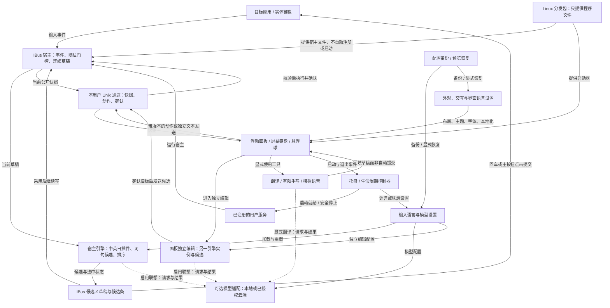
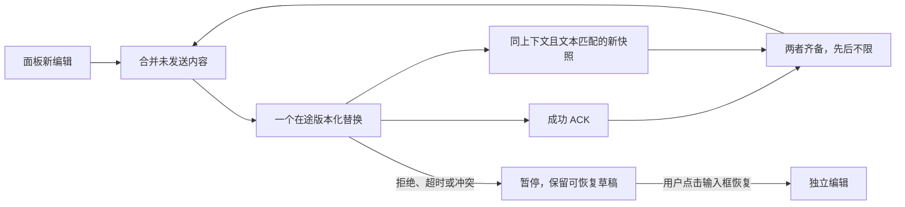

# Suzaku 当前功能链路网络

快照日期：2026-09-23。范围：**0.6.3 源码**，以 Linux / IBus 为核心。
审计基线提交：`a0c8dbf20fec8cf974cffddaf8026f902387ac04`（`0.5.5`）。
基线上叠加的 Compose/死键处理、英文补全改进、首轮链路修复和 Clippy 清理已纳入 0.5.6；
第二至第七轮的 N05–N18 修复纳入 0.5.7，见 [0.5.7 说明](releases/0.5.7.md)。
第八至十轮 N19–N23 纳入 0.5.8，见 [0.5.8 说明](releases/0.5.8.md)。
第十一至十四轮 N24–N28 纳入 0.5.9，见 [0.5.9 说明](releases/0.5.9.md)。
第十五至十七轮 N29–N32 纳入 0.6.0，见 [0.6.0 说明](releases/0.6.0.md)。
第十八至二十一轮 N33–N37 纳入 0.6.1，见 [0.6.1 说明](releases/0.6.1.md)。
第二十二至二十五轮的长草稿回归、实际应用检查及 N38–N40 修复纳入 0.6.2，见
[0.6.2 说明](releases/0.6.2.md)。第二十六至二十八轮的 N41/N42 修复、系统弹窗及
输入生命周期回归纳入 0.6.3，见 [本版说明](releases/0.6.3.md)；不表示已更新分发包或安装版。
第二十二轮补充长草稿限长回归，未确认新缺陷。
第二十三轮补充实际 GTK 应用检查并修复 N38 同步客户端预编辑残留。
第二十四轮补充 Chrome/Qt 输入检查，记录当轮未解决的客户端切框确认与数字用途缺失限制。
第二十五轮以候选区草稿与空草稿数字直通修复 N39/N40；默认预览位置变化。
第二十六轮补测系统 GTK3 候选弹窗，修复 N41 长草稿预览超出屏幕，已纳入 0.6.3。
第二十七轮补测实际应用的输入法切换、隐私边界及进程重连；未确认新缺陷。
第二十八轮以 N42 显示层兼容处理解决 Suzaku 候选序号点击，已纳入 0.6.3。
下表保留「开发」标记以区分相对 0.5.5 的变化；源码版本不表示已有可下载安装包。
各轮审计报告中的未提交/待发布表述记录当时状态，发布归属以本页和版本说明为准。
这不是本机正在运行的安装版清单，也不是逐函数调用图、网络端口扫描或完成率统计。

共枚举 **8 个功能域、56 条链路（F01–F56）**。每条记录入口、处理路径、结果、
失败边界及源码依据。一个链路可能跨多个模块，一个模块也可能服务多个链路。

后续实测：[第一轮链路审计与修复（2026-09-13）][audit] 的 4 个问题（N01–N04）
已纳入 0.5.6 并加入回归；未改动本机安装。「接通」仍不代表未覆盖场景也已通过验收。

第二轮：[工具回填审计（2026-09-13）][tools-audit] 检查 F32–F35，确认 N05 自动语音回填
跨输入上下文、N06 独立编辑器插入词边界错误，**已纳入 0.5.7**。
语音采集绑定原目标，换框/断连后保留转写供手动采用；工具回填统一按光标两侧补分隔。

第三轮：[设置确认与持久化审计（2026-09-13）][settings-audit] 检查 F42/F44，确认
N07 首次状态覆盖新选择、N08 旧宿主覆盖待重载配置（含授权）、N09 外观保存失败无提示，
**已纳入 0.5.7**。启动点击独立追踪；条件保存与写锁拒绝旧配置覆盖；
外观保存失败保留预览，显示未保存和重试入口。专项回归已加入 Linux CI。

第四轮：[备份、恢复与运行锁审计（2026-09-13）][data-audit] 检查 F45–F49，确认
N10 文件软链接配置与不同运行目录组合下的运行锁漏检，**已纳入 0.5.7**。
生命周期内保留链接各层及读取目标的锁，原子保存替换链接后也不提前释放；写锁同步覆盖别名。
五种路径的真实宿主回归及备份/恢复失败保护通过，已加入 Linux CI。

第五轮：[Linux 分发与注册审计（2026-09-13）][packaging-audit] 检查 F50–F53 和 F07。
干净 Ubuntu 容器的安装、升级、中文面板启动、卸载与合成数据保留通过；另确认 N11 首次
注册失败重试遗漏自启、N12 `diag` 隐式安装、N13 外部桌面命令缺少超时、N14 新报告打包遗漏，
**已纳入 0.5.7**。首次自启使用持久的未完成标记；诊断只读；桌面命令和恢复
重试有时限；补齐报告并校验包内链接。原失败诊断已转为现有 Linux CI 覆盖的回归。

第六轮：[模型配置与异步结果审计（2026-09-13）][model-audit] 检查 F22–F28 与 F34/F35/F44。
确认 N15 面板未重载就采纳新目标、N16 compatible 未完成回复进入候选，**已纳入 0.5.7**。
候选绑定已确认配置，翻译遇目标/授权冲突先拒绝；文本与类型统一校验完成状态。
816 项常规测试、12 组私有窗口、3 组设置、原生 IBus 与严格 Clippy 通过。

第七轮：[候选采用与回退审计（2026-09-13）][completion-audit] 检查 F11–F13、F31/F36。
确认 N17 独立面板快速连续选词/回退被槽位去重吞掉、N18 词候选耗尽后回退入口消失，
**已纳入 0.5.7**。保留重复释放、旧编辑载荷和异步候选变化保护；有历史但没有
下一个词时保留紧凑回退行，不改变 IBus 一步补全撤销或实际提交规则。
818 项常规测试、12 组私有窗口、原生 IBus 与两套严格 Clippy 通过。

第八轮：[启动、退出与失败重试审计（2026-09-13）][lifecycle-audit] 检查 F02/F03/F04/F06。
确认 N19 停止服务后的恢复失败被退出重试跳过、N20 排队启动在 inactive 状态下丢失清理
责任，**已纳入 0.5.8**。恢复目标保留到读回确认，尊重用户手动切换；
已接管单元的启动取消必须明确完成，不能仅凭未运行状态跳过。
823 项常规测试、12 组私有窗口、原生 IBus 与两套严格 Clippy 通过；故障时序由合成
后端验证，不据此宣称真实 GNOME/systemd 会话的故障场景已全部验收。

第九轮：[单实例启动与候选面板唤出审计（2026-09-13）][wakeup-audit] 检查 F01/F05/F29。
确认 N21 单实例保护失败后继续多开、N22 合并快照遗漏新上下文的唤出，**已纳入 0.5.8**。
启动错误不再绕过运行锁；自动唤出根据当前上下文判断，不依赖观察到
中间空状态，同时保留手动隐藏、隐私与焦点保护。两项新增隔离回归已接入 Linux UI CI。
823 项常规测试、13 组私有窗口和 1 组程序入口测试、原生 IBus 与两套严格 Clippy 通过。

第十轮：[工具采用手势与输入目标审计（2026-09-23）][tool-gesture-audit] 检查 F29/F30/F32/F33。
确认 N23 按下语音插入/手写候选后切换目标，松开旧手势会向新目标回填，**已纳入 0.5.8**。
目标变化取消旧按压，保留来源供重新点击；同框刷新和本地编辑不受影响。
新增 64 组鼠标/触摸组合回归，接入工具专项及 Linux UI CI；823 项常规测试、14 组私有
窗口和 1 组程序入口测试、原生 IBus 与两套严格 Clippy 通过。合成快照与动作队列验证
不代表真实应用已被写入或全面桌面验收。

第十一轮：[翻译请求与取消边界审计（2026-09-23）][translation-audit] 检查 F34/F35 与 F29。
确认 N24 旧的 Translate 按压在换框/改原文后向模型发送新草稿，**已纳入 0.5.9**。
请求发出前也取消失效手势；本地修改和取消操作不会保留旧按压；纯元数据刷新及重新点击
仍可正常翻译。34 组鼠标/触摸组合先复现再通过，HTTP 仅使用测试拥有的回环模拟服务。
823 项常规测试、15 组私有面板和 1 组程序入口测试、原生 IBus 与两套严格 Clippy 通过。

第十二轮：[工具回填后的连续输入审计（2026-09-23）][insertion-followup-audit] 检查 F35 → F30，
并覆盖 F32/F33 的共用回填路径。确认 N25 回填成功确认先于新快照时，屏幕键盘沿旧原文和
旧版本继续发送，**已纳入 0.5.9**。后续编辑从已确认文本继续，等匹配的新快照
才发送；没有后续编辑时以最新快照为准，不重放已确认文本或覆盖实体键盘修改。
三种来源的 6 组确认顺序/续写检查及 30 组共用边界回归通过；823 项常规测试、
15 组私有面板和 1 组程序入口测试、原生 IBus 与两套严格 Clippy 通过。

第十三轮：[原生候选操作与连续输入审计（2026-09-23）][native-actions-audit] 检查
F13/F29/F30 与 F05。确认 N26 非工具候选操作成功后仍复用旧草稿/版本、N27 中间空快照
把仍有待发送草稿的面板收起，**均已纳入 0.5.9**。所有原生动作共用确认与
新快照保护；自动显隐考虑同一公开输入目标的待发送草稿，仍尊重手动隐藏和隐私边界。
新增 86 组操作/顺序、迟到确认和窗口显隐场景全部通过；823 项常规测试、16 组私有
面板和 1 组程序入口测试、原生 IBus 与两套严格 Clippy 通过。合成窗口测试不代表
真实 GNOME/Wayland 桌面或已安装版本验收。

第十四轮：[原文候选选择与状态发布审计（2026-09-23）][literal-selection-audit] 检查
F11/F12/F13 → F29。确认 N28 数字选回原文时内部选择已生效，但候选栏和伴随快照仍显示
旧选中项，**已纳入 0.5.9**。文字未变也发布新的选择与版本，不重建候选或
解除锁定；保留原文续写、逐字符删除和一步补全撤回，三语 12 组专项回归已通过。
823 项常规测试、16 组私有面板和 1 组程序入口测试、完整私有 IBus 链与两套严格
Clippy 通过；未修改本机安装版本或个人会话。

第十五轮：[同值设置与输入状态审计（2026-09-23）][noop-controls-audit] 检查
F15/F42/F44 → F09/F11/F12/F27。确认 N29 重选当前语言清掉草稿/撤回/重音组合、
N30 重复设置相同联想值重建候选并解除选择锁定，**均已纳入 0.6.0**。
只在真正切换语言时清稿，同值窄设置不重建引擎；保留条件保存、失败保护与显式重载。
新增 41 组同值、保存失败及模型候选场景已通过，不操作个人桌面会话或真实模型。
823 项常规测试、16 组私有面板和 1 组程序入口测试、3 组设置专项、完整私有 IBus 链
与两套严格 Clippy 通过；未构建分发包或修改本机安装版本。

第十六轮：[输入引擎销毁与候选收尾审计（2026-09-23）][engine-destruction-audit] 检查
F14 → F26/F28/F29。确认 N31 未先失焦的活动引擎销毁后，既有订阅仍显示旧草稿和候选，
**已纳入 0.6.0**。销毁当前对象时结束字段会话、取消预测并发布无焦点空帧；
旧对象迟到销毁不影响新字段。三语 30 组状态检查和 4 组受控模型时序检查已通过，
不操作个人桌面输入法或真实模型。
823 项常规测试、16 组私有面板和 1 组程序入口测试、3 组设置专项、完整私有 IBus 链
与两套严格 Clippy 通过；未修改安装版本。

第十七轮：[原生连续提交与模型上下文审计（2026-09-23）][commit-context-audit] 检查
F13 → F26/F28。确认 N32 原生宿主沿用编辑器的英文自动分隔，模型上下文比实际候选
提交多出空格，**已纳入 0.6.0**。宿主按候选载荷原样累积，独立编辑器的
分隔/撤销不变；20 组原生模型请求检查及 2 项 Rust 回归通过。模型仍只接收当前字段
最近 160 字符，不采集应用周边文本。
825 项常规测试、16 组私有面板和 1 组程序入口测试、3 组设置专项、完整私有 IBus 链
与两套严格 Clippy 通过；未构建分发包或修改安装版本。

第十八轮：[输入类型边界与独立面板发送审计（2026-09-23）][content-type-audit] 检查
F08/F14 → F29/F30/F31。确认 N33 隐私/直通模式变化未更新输入目标标识、N34 独立面板
字面发送未拦截 PRIVATE 标记，**已纳入 0.6.1**。真实模式边界使旧请求失效，
普通提示更新和旧对象事件不打断当前字段；PRIVATE 保留原生本地输入，但禁止面板注入。
117 组新增原生场景、825 项常规测试、16 组私有面板和 1 组程序入口、3 组设置专项、
完整私有 IBus 链与两套严格 Clippy 通过；未修改本机安装或个人会话。

第十九轮：[语言切换与延迟发送审计（2026-09-23）][language-target-audit] 检查
F15/F44 → F14/F29/F30/F31。确认 N35 语言切换成功后未更换输入目标，旧发送仍可成功并
清掉新草稿，**已纳入 0.6.1**。实际语言切换推进目标标识，切走再切回也不
恢复旧绑定；同语别名、同语重载与失败操作仍保留当前目标。96 组原生及 20 组面板新增
场景、825 项常规测试、完整私有 IBus 链、16 组面板和 1 组入口、3 组设置专项与两套
严格 Clippy 通过；未修改本机安装或个人会话。

第二十轮：[取消输入与在途操作审计（2026-09-23）][cancel-target-audit] 检查
F14 → F29/F30/F31。确认 N36 整段 Esc/当前对象 Reset 后旧发送仍能上屏并清掉新草稿，
**已纳入 0.6.1**。整段取消更换目标标识；仅取消 Compose、普通删字和
面板确认后的连续输入不受影响，同框已提交的联想历史保留。新增 71 组原生/模型、
20 组面板场景通过；825 项常规测试、完整私有 IBus 链、16 组面板和 1 组入口、
3 组设置专项与两套严格 Clippy 通过；未修改本机安装或个人会话。

第二十一轮：[外部提交与连续输入审计（2026-09-23）][commit-target-audit] 检查
F13/F14 → F29/F30/F31。确认 N37 外部提交成功后旧发送仍能追加上屏、清掉下一段草稿，
**已纳入 0.6.1**。实体回车、原生候选条点击和独立字面发送成功后更换目标；
伴随面板带版本提交仍保留确认后的续写，普通编辑和失败操作不换目标。新增 104 组
原生/模型及 12 组面板场景、825 项常规测试、完整私有 IBus 链、16 组面板和 1 组入口、
3 组设置专项与两套严格 Clippy 通过；未修改本机安装或个人会话。

第二十二轮：[长草稿与联想限长审计（2026-09-23）][draft-limits-audit] 检查
F09/F10/F13 → F20/F26/F28 → F29/F30，**未确认新的产品缺陷**。新增 72 组原生
字节边界、8 组在途/已就绪模型边界和 1 项含 30 组组合的宿主单测，验证 Unicode、
Compose、镜像隐藏/恢复、完整提交和联想恢复。超过镜像预算仍会隐藏面板正文，
并非解除长度限制；详见报告，不操作个人桌面会话或真实模型。

第二十三轮：[GTK 实际应用与预编辑清理审计（2026-09-23）][gtk-apps-audit] 检查
F10–F14/F29。确认 N38 同步 IBus 客户端不处理 hide-only 事件，结束输入后可能
残留旧预编辑；改发空文本不可见更新。新增 12 组同步协议回归和 8 组真实 GTK
应用工作流；未声明隐私用途的旧式隐藏文本框仍是外部应用限制，不能算作隐私通过。

第二十四轮：[浏览器与 Qt 英文输入审计（2026-09-23）][cross-apps-audit] 检查
F08/F10–F14/F29。Chrome 与 Qt 5/6 的普通补全、选区/光标插入、取消、密码按键和
恢复路径通过；客户端可能自行确认切框前的草稿，且本机三类客户端的数字用途未传达，
`12.5` 会误触候选选择。两项限制在当轮未解决，后续默认模式修复见第二十五轮；
当时显式 Escape/Alt 数字仅为已验证的临时方式，
不改变数字优先选择规则，也不把这些应用列为全面兼容。

第二十五轮：[跨应用草稿与数字兼容修复（2026-09-23）][cross-app-fixes-audit] 修复
N39 客户端切框自行确认行内草稿、N40 未标记用途的数字输入误触候选槽位。默认草稿
保留在候选区/伴随面板，Enter/点击才提交；空草稿数字直接交还应用，有草稿时数字仍
选词。Chrome/Qt 五种配置 115 组严格回归覆盖正文不变、选区取消、数字与普通候选恢复。
用途未知的字段并未因此被识别为私密；高级行内模式仍有客户端自行确认风险。
115 组跨应用、8 组 GTK、默认/行内两套完整原生 IBus、826 项常规测试、16 组面板与
1 组入口检查、两套严格 Clippy 均通过；未重新打包、安装或运行远端 CI。

第二十六轮：[原生候选弹窗审计（2026-09-23）][native-popup-audit] 检查 F10–F14/F29。
实际鼠标文字点击、翻页、滚轮、取消与边缘定位补充 29 组严格回归。确认并修复 N41：
160 码点的草稿仍可能把不换行的系统候选窗撑到 2795 像素宽；预览新增 48 显示列预算，
完整草稿与提交、模型上下文不变，**已纳入 0.6.3**。测试中的 800×600 弹窗完整可见。
系统 IBus 1.5.29 左侧序号栏另有无效索引问题，当轮严格附加复现失败，不计为验收通过，
也未修改系统组件。默认门禁只覆盖候选文字区，不宣称 GNOME Shell/Wayland 或任意 DPI 适配。
后续 Suzaku 显示层兼容处理见第二十八轮。

第二十七轮：[实际输入生命周期审计（2026-09-23）][app-lifecycle-audit] 检查 F03/F08/F14/F29。
新增 21 组真实 GTK 应用流程：三语切换、密码框、系统候选面板重启、伴随面板重启和
宿主退出后显式重启/激活；覆盖草稿、已采用候选与未完成 Compose 三种状态。
通过实际候选窗、合成文档正文及版本令牌检查取消、恢复和拒绝旧请求，**未确认新缺陷**。
系统面板按夹具默认配置重选 US 时清稿，伴随面板重启则保留宿主草稿，两者不能混同。
这不是桌面 systemd 自动恢复、原生 Wayland 或草稿持久化验收。

第二十八轮：[序号点击兼容修复（2026-09-23）][ordinal-click-audit] 处理 F11/F13。
旧版系统面板的实际序号点击再次复现无效索引 16；N42 将可见上标移入候选正文点击区，
独立标签置空，保留页内编号与完整提交，不猜测或钳制错误索引。新增 17 组真实字形点击，
使弹窗门禁从 29 组扩展为 46 组；原生协议另外验证 6 组非法索引拒绝。
**已纳入 0.6.3**。无需修改系统 IBus，不能据此宣称上游组件或其他输入法的同类问题也已修复。

## 1. 先看整体

最核心的闭环是：**输入事件 → 连续草稿 → 本地候选 → 可选模型补充 → 采用后继续写 / 明确提交**。
面板是原生输入的伴随界面，同时保留独立编辑路径；工具结果先回到草稿，不直接视为提交成功。

下图是逻辑路由，不表示全部函数调用。实线表示已实现的路径，虚线表示需要启用或显式触发的模型请求。
同一引擎/模型代码可以在不同进程实例化，不代表面板和宿主共享一份内存状态。
可单独编辑或导入的图源见 [functional-network.mmd](functional-network.mmd)。

```mermaid
flowchart TB
    APP["目标应用 / 实体键盘"]
    INPUT["IBus 宿主：事件、隐私门控、连续草稿"]
    CORE["宿主引擎：中英日插件、词句候选、排序"]
    CAND["IBus 候选区草稿与候选条"]
    IPC["本用户 Unix 通道：快照、动作、确认"]
    PANEL["浮动面板 / 屏幕键盘 / 悬浮球"]
    LOCAL["面板独立编辑：另一引擎实例与候选"]
    TOOLS["翻译 / 有限手写 / 模拟语音"]
    MODEL["可选模型适配：本地或已授权云端"]
    TRAY["托盘 / 生命周期控制器"]
    SERVICE["已注册的用户服务"]
    IMESET["输入语言与模型设置"]
    UISET["外观、交互与界面语言设置"]
    DATA["配置备份 / 预览恢复"]
    PACKAGE["Linux 分发包：只提供程序文件"]

    APP -->|输入事件| INPUT
    INPUT -->|当前草稿| CORE
    CORE -->|候选与选中状态| CAND
    CAND -->|采用后继续写| INPUT
    CAND -->|回车或主按钮点击提交| APP
    INPUT -->|当前公开快照| IPC
    IPC -->|镜像| PANEL
    PANEL -->|带版本的动作或独立文本发送| IPC
    IPC -->|校验后执行并确认| INPUT
    PANEL -->|进入独立编辑| LOCAL
    LOCAL -->|确认目标后发送候选| IPC
    PANEL -->|显式使用工具| TOOLS
    TOOLS -->|回填草稿而非自动提交| PANEL
    CORE -.->|启用联想：请求与结果| MODEL
    LOCAL -.->|启用联想：请求与结果| MODEL
    TOOLS -.->|显式翻译：请求与结果| MODEL
    PANEL -->|启动与退出事件| TRAY
    TRAY -->|启动就绪 / 安全停止| SERVICE
    SERVICE -->|运行宿主| INPUT
    TRAY -->|语言或联想设置| IMESET
    IMESET -->|加载与重载| CORE
    IMESET -->|模型配置| MODEL
    IMESET -->|独立编辑配置| LOCAL
    UISET -->|布局、主题、字体、本地化| PANEL
    DATA -->|备份 / 显式恢复| IMESET
    DATA -->|备份 / 显式恢复| UISET
    PACKAGE -->|提供宿主文件，不自动注册或启动| INPUT
    PACKAGE -->|提供启动器| PANEL
```

状态含义：

- **接通**：源码具有入口到结果/明确失败的处理路径，不等于所有桌面兼容或生产稳定。
- **开发**：相对基线新增/增强；第一至第七轮纳入 0.5.6/0.5.7，第八至十轮纳入 0.5.8，第十一至十四轮纳入 0.5.9，第十五至十七轮纳入 0.6.0，第十八至二十一轮纳入 0.6.1，第二十二至二十五轮纳入 0.6.2，第二十六至二十八轮纳入 0.6.3。
- **受限**：路径存在，但词库、识别器、外部模型或平台验收存在明确限制。
- **实验 / 预留**：接口、原型或其他平台代码存在，不能计作 Linux 主线可用能力。

## 2. 功能链路逐项枚举

### A. 启动、激活、退出与诊断（F01–F07）

| ID | 入口 → 处理 → 结果 | 失败 / 边界 | 状态与源码 |
| --- | --- | --- | --- |
| F01 | 启动面板 → 运行锁、单实例检查 → 创建窗口；重复启动向已有实例发显示请求 | 不重复建立托盘和编辑状态；运行锁/唤出通道失败时拒绝无锁多开，见 [N21][wakeup-audit]；请求送出不等于已有窗口已完成显示 | 接通＋0.5.8 修复：[面板入口][panel]、[单实例][instance] |
| F02 | 面板启动 → 后台生命周期控制器 → 启动已注册用户服务、探测实际就绪 | 不自动注册缺失服务，不切走当前输入法；不管理独立启动的自定义宿主；启动排队/超时仍保留退出清理责任，见 [N20][lifecycle-audit] | 接通＋0.5.8 修复：[托盘][tray]、[服务控制][service] |
| F03 | 托盘「激活」 → 确保宿主就绪 → 记住当前输入法 → 切换并读回确认 | 超时仍保留恢复目标；重复激活不把 Suzaku 自身记作恢复项 | 接通：[激活控制][activation] |
| F04 | 托盘「释放」 → 检查实际当前输入法 → 恢复此前观察到的输入法 | 用户已经手动切走时尊重该选择；释放不停止面板/服务 | 接通：[激活控制][activation] |
| F05 | 隐藏、关闭到托盘、收成球 → 窗口状态变化 → 宿主继续工作 | 没有可用托盘图标时，关闭唯一窗口走完整退出；手动隐藏绑定当前上下文，新输入框可重新唤出，见 [N22][wakeup-audit]；同框待发送草稿不因中间空快照自动收起，仍尊重手动隐藏/隐私，见 [N27][native-actions-audit] | 接通＋0.5.8 修复＋0.5.9 修复：[面板事件][panel]、[窗口管理][windowing]、[托盘][tray] |
| F06 | 完整退出 → 恢复输入法 → 停止受管宿主 → 清理工作线程与窗口 | 无法确认安全恢复目标、恢复/停止失败则保留界面报错；退出重试须完成停止后的恢复与排队启动取消，见 [N19/N20][lifecycle-audit]；不重启 IBus，不更改锁定键/键盘布局 | 接通＋0.5.8 修复：[激活控制][activation]、[服务控制][service] |
| F07 | `linux-register status/verify/diag`、宿主报告、面板状态 → 检查注册/运行可见性/服务 → 分层诊断 | 只有注册文件不等于正在可用；UI 使用缓存与后台刷新，报告型程序不等于原生宿主；开发版 `diag` 为只读验证，外部查询有界且失败不虚报就绪，见 [N12/N13][packaging-audit] | 接通＋0.5.7 修复：[维护入口][tool]、[状态缓存][status-cache]、[运行报告][runtime-report] |

### B. 原生键盘、连续草稿与提交（F08–F14）

| ID | 入口 → 处理 → 结果 | 失败 / 边界 | 状态与源码 |
| --- | --- | --- | --- |
| F08 | IBus 焦点与按键事件 → 输入用途、修饰键、活动引擎检查 → 交给草稿或交还应用 | 密码/PIN/数字/小数/电话用途绕过组合；系统快捷键不当作候选键；依赖应用正确声明输入用途 | 接通：[IBus 桥][ibus] |
| F09 | 死键 / Compose 序列 → 当前引擎的组合状态 → 完整可打印 UTF-8 结果进入草稿 | 未完成序列不进入模型；Esc/Backspace 先取消序列；缺失表、超限/控制字符不伪造结果；支持范围不是所有布局 | 开发：[Compose][compose]、[构建依赖][build]、[隔离夹具][compose-fixture] |
| F10 | 普通字母/合法字符 → 保留原始拼写的草稿 → 本地候选立即更新 | 草稿中的空格/标点不提交；未明确选中候选时空格不强制改词；草稿外非起笔标点交还应用；候选区草稿预览受 48 显示列和 160 码点双重限制，完整载荷不截断，见 [N41][native-popup-audit] | 接通＋0.6.3 修复：[IBus 桥][ibus]、[宿主会话][host] |
| F11 | Tab/方向键/翻页选中 → 1–6 或 Shift+Enter 采用 → 替换草稿继续写；显式选中后 Space 采用并加空格 | 数字键是当前页槽位；无候选的槽位不偷偷插入数字；Alt+数字/小键盘用于字面数字；Shift/AltGr 尊重布局解析结果；选回原文即使文字未变，也发布选中项及新版本，见 [N28][literal-selection-audit] | 接通＋0.5.9 修复：[IBus 桥][ibus]、[补全读取与锁定][core] |
| F12 | 立即 Backspace → 撤回最近一次补全；普通 Backspace → 删末尾字符；英语 Ctrl+Backspace → 删末尾空白分隔词；Esc → 清稿 | 补全撤回是一步且受后续编辑/选择影响；不是任意历史撤销，也不撤销目标应用已经接收的文本 | 接通：[IBus 桥][ibus] |
| F13 | Enter / 候选主按钮点击 → 选中完整候选载荷 → IBus CommitText → 清草稿与显示 | 权重、词句角标、AI 标签不写进正文；普通候选采用不是提交；已接受的纯空格草稿也能无损提交，见 [N03][audit]；伴随面板收到提交成功确认后，从空草稿继续键入并等待新版本，不带回已提交原文，见 [N26][native-actions-audit]；外部实体回车/原生候选点击成功后更换操作目标，旧发送和排队按键不跨入下一段，见 [N37][commit-target-audit]；可见上标与正文共用点击区，翻页后仍使用正确页内索引，见 [N42][ordinal-click-audit] | 接通＋开发＋0.5.9 修复＋0.6.1 修复＋0.6.3 修复：[IBus 桥][ibus]、[宿主提交][host]、[确认同步][native-sync] |
| F14 | 焦点、语言、隐私、Reset/停用/销毁边界 → 清理所属草稿/会话与异步结果 → 新字段重新开始 | FocusOut 迟到/缺失也不能把旧字段带入新字段；活动对象直接销毁时发布无焦点空帧并取消预测，旧对象销毁不动新字段，见 [N31][engine-destruction-audit]；PRIVATE 允许本地候选，但禁止联想、公开镜像与面板注入；隐私/直通边界更换目标标识，见 [N33/N34][content-type-audit]；整段 Esc/当前对象 Reset 同样作废旧目标，Compose-only 取消和面板续写除外，见 [N36][cancel-target-audit]；模型重载与语言切换的清理范围不同 | 接通＋0.6.0 修复＋0.6.1 修复：[IBus 桥][ibus]、[宿主设置边界][host]、[原生镜像][native-sync] |

### C. 语言、词句候选与排序（F15–F21）

| ID | 入口 → 处理 → 结果 | 失败 / 边界 | 状态与源码 |
| --- | --- | --- | --- |
| F15 | 输入语言选择 → `BuiltinLanguage` / `LanguageRegistry` → 英文、简体拼音、日文罗马音插件 | 输入语言独立于 UI 和翻译语言；别名归一；重选同一语言保留草稿、撤回及 Compose，真正切换仍清理，见 [N29][noop-controls-audit]；0.6.1 成功切换时更换目标标识，合并语言往返快照后旧发送/按压仍失效，见 [N35][language-target-audit]；插件接口存在不代表任意新语言自动可用 | 接通＋0.6.0 修复＋0.6.1 修复：[语言注册][languages]、[引擎插件接口][core] |
| F16 | 英文自然词前缀 → 有限词库索引、大小写与撇号匹配 → 补完当前词 | 保留原文；不拆开 URL/标识符/混合词做强制纠错；直/弯撇号一致性是工作区增强 | 接通＋开发：[英语][english]、[内置词库][lexicon] |
| F17 | 英文多词草稿 / 尾随空格 → 匹配较长上下文、搭配和短句 → 同时给词与句子续写 | 会话已提交片段只辅助排序，不重复输出；固定搭配不是通用语法分析；`how can I ` 优先 `help` 等为本轮开发改进 | 开发、词库受限：[英语][english]、[质量回归][english-quality] |
| F18 | 拼音、声调形式、音节边界或已转换前缀 → 有限词表与末音节补全 → 汉字词句候选和原文 | 非完整长句转换/个人词库；未知输入保留字面回退；原生声调数字须遵守 F11 的字面数字路径 | 受限：[中文插件][chinese] |
| F19 | 罗马音 → 平假名转换、有限词表/词尾补全 → 汉字/假名/片假名及原文候选 | 处理促音、小假名、拨音等规则，但没有完整日文形态分析器 | 受限：[日文插件][japanese] |
| F20 | 各类本地候选 → Literal / Word / Sentence 分类、去重、权重排序 → IBus 最多 12 项、每页 6 项及类型/来源角标 | 英语原文与最佳本地补全保留位置；CJK 转换优先且原文可选；权重不是统计置信度；其他宿主不自动套用 IBus 混排策略 | 接通：[候选混排][mix]、[引擎][core]、[显示规则][candidate-doc] |
| F21 | 信号参数 / 输入源枚举 → 置信度、降级与确认门控 → 提交结果或需确认提示；引擎可撤回内存提交记录 | 核心与演示路径存在；`GazeDwell` / `HandTracking` 名称不代表已接入眼动/手追踪硬件；内存 undo 不反向编辑外部应用 | 实验：[核心状态机][core]、[演示入口][demo] |

### D. 模型接入、异步联想与安全回退（F22–F28）

| ID | 入口 → 处理 → 结果 | 失败 / 边界 | 状态与源码 |
| --- | --- | --- | --- |
| F22 | `model configure` / 配置加载 → scope、protocol、endpoint、model、密钥变量引用、授权校验 → 通用模型提供器 | 模型名与功能解耦；Llama 命名保留兼容别名；云端需明确 HTTPS、模型与授权；不保存密钥值；开发版独立面板绑定已确认配置，见 [N15][model-audit] | 接通＋0.5.7 修复：[模型命令][model-cli]、[提供器][model]、[LLM 接口][llm] |
| F23 | 默认 `auto` / 显式发现 → 固定回环端点读取已提供模型元数据 → 优先 LLaMA，允许其他本地模型 | 默认探测 11434 / 8080 / 1234；不扫局域网、不读权重、不下载、不启动模型服务；本地网关仍可能自行转发外部 | 接通：[发现与缓存][model-runtime] |
| F24 | 托盘检查 / `model status` / 显式 `model probe` → 运行时状态或合成输入探针 → 状态报告/候选诊断 | status/discover 不生成文本；probe 会向配置服务发合成请求，云端可能计费；可用不等于已加载，不等于质量合格 | 接通：[模型命令][model-cli]、[模型运行时][model-runtime]、[托盘][tray] |
| F25 | 显式「预热」 → 支持的本地 Ollama 请求 → 模型短期驻留 | 不自动预热，不适用于任意云服务；keep-alive 5 分钟是服务请求参数，不是 Suzaku 接管模型进程 | 接通、协议受限：[模型运行时][model-runtime] |
| F26 | 启用联想后的草稿变化 → 120 ms 防抖、单工作线程、可替换待办 → 后台推理，前台继续输入 | 旧任务/结果按修订失效；进行中的调用受超时限制；不在 UI/IBus 线程等待模型 | 接通：[预测工作线程][prediction]、[引擎调度][core] |
| F27 | Ollama / compatible 回复 → 解析、限长、校验、归一、去重 → 合并词句候选 | 不覆盖已锁定选择；英语保留输入前缀；工作区可从合法整句提取首个完整词，并统一精确前缀＋新增文本预算；无效结果不挤掉本地候选，见 [N02][audit]；开发版拒绝 compatible 工具转交/未知完成状态，见 [N16][model-audit] | 接通＋0.5.7 修复：[协议与请求][model]、[传输][transport]、[混排][mix]、[英语派生词][english] |
| F28 | 超时/服务不可用/无有效候选/关闭联想/隐私边界 → 保留本地结果或取消旧请求结果 → 继续离线输入 | 不暗中改用云端、不自动纠错；发送后不能撤回服务已收到的数据；请求仅携带本字段最近 160 字符的候选提交历史，不采集周边应用文本；宿主原样累积载荷、不增加编辑器分隔，见 [N32][commit-context-audit] | 接通＋0.6.0 修复：[宿主会话][host]、[预测线程][prediction]、[传输][transport]、[隐私说明][privacy-doc] |

### E. 伴随面板、输入工具与回填（F29–F35）

| ID | 入口 → 处理 → 结果 | 失败 / 边界 | 状态与源码 |
| --- | --- | --- | --- |
| F29 | 宿主发布快照 → 后台订阅、只保留最新状态 → 面板镜像当前草稿/候选并随输入事件显示 | 不是第二个候选引擎；不镜像隐私字段/提交历史；慢读者重连取当前全量，不重放历史；合并中间空快照不再阻止新上下文唤出，见 [N22][wakeup-audit]；空快照与本地续写并存时不闪烁隐藏，见 [N27][native-actions-audit] | 接通＋0.5.8 修复＋0.5.9 修复：[原生同步][native-sync]、[通道客户端][sync-client]、[宿主发布][companion-c] |
| F30 | 原生镜像中的屏幕键盘连续点击 → 未发送编辑合并、单个在途替换 → ACK 与匹配的新快照齐备后再发下一笔 | 匹配快照可见时两者可任意先到；超时/拒绝/冲突则暂停并保留草稿；合并快照后的同值回退不自动重放，见 [N04][audit]；目标变化在焦点/设置返回之前取消旧按压，见 [N23][tool-gesture-audit]；从工具确认文本续写，见 [N25][insertion-followup-audit]；候选采用/选择切换/提交/清空同样等待新版本，见 [N26/N27][native-actions-audit] | 接通＋开发＋0.5.8 修复＋0.5.9 修复：[编辑缓冲][native-typing]、[同步控制][native-sync] |
| F31 | 点击输入框进入独立编辑 → 文本/光标/选择/组合事件 → 面板自己的候选 → 确认目标后发送 | Linux 通过原生宿主文本通道发送；目标是面板/设置自己时阻止；0.6.1 拒绝 PRIVATE 及跨隐私/直通模式的旧发送，见 [N33/N34][content-type-audit]；交付失败保留草稿，不把本地提交当作外部成功；开发版快速新手势可继续选词/回退，候选耗尽也保留待撤销入口，见 [N17/N18][completion-audit] | 接通＋0.5.7 修复＋0.6.1 修复：[键盘编辑][keyboard]、[面板组合][composition]、[发送控制][controller]、[文本输出][text-output] |
| F32 | 鼠标/触摸笔迹 → 采样、限界、平滑/分组、启发式识别 → 选择结果回填草稿 | 可撤销笔画/清空；不是通用 OCR；独立联想可附带笔迹摘要，不上传笔迹图像；原生回填失败保留来源；统一光标两侧分隔并保留插入位置，见 [N06][tools-audit]；原生目标变化取消旧候选按压，保留笔迹供重新点击，见 [N23][tool-gesture-audit]；回填后连续键入遵守新快照屏障，见 [N25][insertion-followup-audit] | 受限＋0.5.7/0.5.8 修复＋0.5.9 修复：[手写交互][handwriting]、[识别与候选预览][panel-support]、[面板模型配置][composition] |
| F33 | 语音工具 Listen / 样例 → 平台识别接口、权限状态、转写稳定判断 → 手动或启用的自动回填 | Linux C 桥仍是模拟链路；回填不直接提交；绑定采集目标，换框/失焦/断连后停止并保留转写；拒绝后不自动重试，见 [N05/N06][tools-audit]；手动插入的旧按压也随原生目标变化取消，仍可重新点击采用，见 [N23][tool-gesture-audit]；回填后连续键入遵守新快照屏障，见 [N25][insertion-followup-audit] | 受限＋0.5.7/0.5.8 修复＋0.5.9 修复：[语音交互][voice]、[语音适配][voice-host]、[Linux 模拟桥][speech-c] |
| F34 | 翻译工具选择源/目标语并点 Translate → 独立工作线程与翻译提示 → 八语译文分页预览 | 不依赖自动联想开关；仅发当前可见草稿，不读剪贴板或选区；需要模型且质量取决于模型，没有离线词库翻译回退；目标/授权与磁盘冲突时不发送，见 [N15][model-audit]；换框/原文变化后取消旧翻译按压，须重新点击，见 [N24][translation-audit] | 接通、模型受限＋0.5.7 修复＋0.5.9 修复：[翻译控制][translation-panel]、[翻译接口][translation]、[翻译提供器][model-translation] |
| F35 | Use draft / Cancel / 修改草稿 / 换字段或工具 → 绑定检查、确认回填或结果失效 → 保留新工作、不让迟到结果覆盖它 | Use draft 只替换草稿；原生回填带版本并防重复点击；译文换行/制表在单行草稿中变为空格；在途请求不能远程撤回；取消也撤销尚未发出请求的 Translate 手势，见 [N24][translation-audit]；成功确认先到时保留后续编辑基准，不沿原文续写或复用旧版本，见 [N25][insertion-followup-audit] | 接通＋0.5.9 修复：[翻译回填][translation-panel]、[工具来源与确认][native-sync] |

### F. 窗口、外观、设置与本地化（F36–F42）

| ID | 入口 → 处理 → 结果 | 失败 / 边界 | 状态与源码 |
| --- | --- | --- | --- |
| F36 | 窗口缩放、工具展开/折叠、候选变化、DPI 变化 → 重算内容布局和窗口尺寸 → 留白随内容收放 | 区分程序发起的尺寸确认与用户手动缩放，限制极端尺寸，避免相互反馈放大；开发版只有撤销历史时保留紧凑行，清空后收紧，测量/词区/句区共用高度，见 [N18][completion-audit] | 接通＋0.5.7 修复：[窗口管理][windowing]、[渲染布局][gpu] |
| F37 | 非功能区拖动 / 悬浮球拖动与点击 → 命中测试、手势阈值、屏幕限界/吸边 → 移动或展开 | 按钮、编辑区、手写画布不当拖拽背景；拖动不误触点击；Linux 无焦点伴随主要走 X11/XWayland | 接通：[窗口管理][windowing]、[交互控制][controller]、[焦点适配][panel-focus] |
| F38 | 主题选择 → 配色、形状与图标资源 → 主面板/设置/悬浮球/托盘一致更新 | 朱雀默认；白虎、青龙、玄武及 Daylight / DeviceDark / Solarized / HighContrast；图形主题不更换输入语言或模型 | 接通：[品牌与图标][brand]、[主题布局][gpu]、[托盘][tray] |
| F39 | 文本与字体设置 → 字体选择/回退、实际像素尺寸栅格化、字形缓存 → GPU 文本渲染 | 避免把小位图放大拉伸；缺字依赖系统字体回退；不能据此保证全部文字系统排版能力 | 接通：[字体解析][fonts]、[字形栅格][font-raster]、[绘制][render] |
| F40 | 设置搜索/分组/滚动、字号/密度/间距、系统标题栏开关 → 布局与命中区同步 → 紧凑设置窗口及应用窗口装饰 | 标签按实际宽度换行；窄窗口重排；隐藏的是系统窗口装饰，不删除应用内的关闭/设置控件 | 接通：[设置场景][settings-scene]、[窗口管理][windowing]、[面板状态][app-state] |
| F41 | UI 语言选择 / System → 静态八语资源和系统语言回退 → 界面、托盘、设置搜索与动态提示即时切换 | 不请求模型；不翻译用户草稿；系统/外部诊断、路径等可保留原文；与输入/翻译语言独立 | 接通：[本地化逻辑][ui]、[资源表][catalog]、[说明][ui-doc] |
| F42 | 面板/设置/托盘修改联想开关或温度 → 单次在途补丁、宿主落盘并确认 → 两窗口与托盘协调 | 状态刷新不是写入确认；失败回退未再次修改的控件；不忙循环重发；开发版保留首次状态前的显式选择，配置冲突时拒绝并提示重载，见 [N07/N08][settings-audit]；同值控制保留候选锁定但仍校验保存，见 [N30][noop-controls-audit] | 接通＋0.5.7 修复＋0.6.0 修复：[设置同步][prediction-settings]、[宿主控制][host]、[托盘][tray] |

### G. 配置、备份、恢复与运行锁（F43–F49）

| ID | 入口 → 处理 → 结果 | 失败 / 边界 | 状态与源码 |
| --- | --- | --- | --- |
| F43 | 启动 / `data status` → 解析 XDG 与设置覆盖路径 → 找到 IME JSON、面板设置与备份位置 | 不扫描输入数据/模型目录；XDG 空值或相对值回退；运行时读取拒绝 FIFO 等特殊文件 | 接通：[数据路径][data-paths]、[安全文件访问][data-files]、[IME 设置][ime-settings] |
| F44 | 设置编辑 / `model configure` / 托盘重载 → 校验、保存、重新配置引擎 → 新偏好生效 | 宿主与开发版独立面板按提供器身份边界清旧预测上下文并保留草稿，见 [N01][audit]；语言变化清理组合，读取失败保留内存配置；开发版条件保存与独立写锁保护待重载文件，外观失败显示未保存并可重试，见 [N08/N09][settings-audit]；面板重建提供器不隐式采用另一份磁盘目标，见 [N15][model-audit] | 接通＋0.5.7 修复：[IME 设置][ime-settings]、[面板持久化][app-state]、[宿主应用设置][host] |
| F45 | 托盘「立即备份」 / `data backup` → 导出白名单设置 → 新备份文件 | 不含草稿、转写、权重或密钥值；含地址与偏好且未加密；未知字段不会作为任意数据打包 | 接通：[备份实现][backup]、[数据命令][data-cli] |
| F46 | `data validate` / `data restore FILE` → 格式、大小、字段、路径校验 → 通过/拒绝或变化预览 | 裸 restore 仅预览；不自动应用、不自动停服务；特殊文件、超限或非法语言值拒绝 | 接通：[备份验证与恢复][backup]、[数据命令][data-cli] |
| F47 | `data restore FILE --apply` → 独占维护锁、预写新旧文件、恢复前备份 → 逐文件原子替换 | 当前仅 Linux 应用恢复；普通 I/O 错误尝试回退；两个文件不是断电原子事务；恢复撤销云端授权；null 项恢复默认 | 接通：[恢复实现][backup]、[维护锁][data-files] |
| F48 | 托盘或 `data open` → 当前目录路径 → FileManager1 打开配置/备份目录 | 服务不可用返回错误与路径，不重启文件管理器；后台执行，不阻塞 UI | 接通：[数据入口][data]、[托盘数据操作][tray] |
| F49 | 面板/宿主启动持有共享运行锁 ↔ 恢复要求独占锁 → 防止运行期覆盖和并发恢复 | 旧运行端点也会阻止恢复；不擅自删除端点、夺锁、杀进程；开发版同时保护链接各层与读取目标，保存替换链接后仍保留锁，见 [N10][data-audit]；手工改向链接需停止后重启；草稿与恢复缓冲仍只有内存耐久性 | 接通＋0.5.7 修复：[文件与锁][data-files]、[面板][panel]、[原生宿主入口][linux-host] |

### H. 分发、验证与其他平台（F50–F56）

| ID | 入口 → 处理 → 结果 | 失败 / 边界 | 状态与源码 |
| --- | --- | --- | --- |
| F50 | Linux 打包脚本 → 构建四个发布程序、启动器、许可/清单/校验和 → `.deb` / `.tar.gz` | 不安装、不注册、不打包个人配置或模型；清单记录提交与 dirty 状态；不是静态万能包或签名证明；开发版补齐审计报告并重定位扁平说明的相对链接，见 [N14][packaging-audit] | 接通＋0.5.7 修复：[打包脚本][package]、[桌面启动器][desktop-file] |
| F51 | 分发包 → 校验成对产物/逐文件内容、依赖和启动器 → 临时目录内包装检查 | 校验和证明完整性而非来源可信；不会把孤立校验文件或缺失程序视为成功；开发版验证包内审计报告链接，见 [N14][packaging-audit] | 接通＋0.5.7 修复：[包验收][package-test]、[包 CLI 回归][package-cli-test] |
| F52 | 明确安装包 / 用户注册 / 升级 / 注销与卸载 → 包管理器和用户级注册工具 → 系统入口可用或移除 | 安装本身不启动/激活；注册需桌面用户、保留原输入法/已有自启偏好；remove/purge 不删除用户配置/备份；开发版持久区分首次自启未完成和已有禁用偏好，桌面命令及恢复重试有界，见 [N11/N13][packaging-audit] | 接通、平台受限＋0.5.7 修复：[注册命令][tool]、[容器安装验收][install-test]、[安装说明][package-doc] |
| F53 | Rust 测试、严格 Clippy、隔离 IBus/窗口链路、打包安装验收、格式/泄密扫描 → CI 分层检查 → 回归结果与产物 | 全功能/全目标严格 Clippy 已通过并加入 Linux CI；默认无 GPU 构建仍非干净门禁；隔离测试不代表真实桌面全兼容，模型质量需另评 | 接通：[CI][ci]、[原生测试入口][native-runner]、[原生链路夹具][native-test] |
| F54 | macOS 应用打包/宿主桥 → InputMethodKit 控制器与 Rust 会话、候选伴随窗口/文本输出适配 | 有原生实现源码与编译检查，不等价于本轮 Linux 级原生验收；`macos_ime_host` 报告程序本身不能证明 IMK 注册成功 | 实验：[macOS 适配][macos-ime]、[IMK 控制器][macos-controller]、[打包入口][macos-bundle] |
| F55 | Windows 平台分发 → TSF 能力描述与推荐标识 → 诊断/预留接口 | `host_registration_ready`、marked-text、commit、native-candidate 均为 false；通用文本输出明确 Unsupported，未形成原生输入闭环 | 预留：[Windows 状态][windows-ime]、[文本输出][text-output] |
| F56 | Android InputMethodService → 字段/键盘策略、JNI 与 Rust 会话 → InputConnection 组合/提交及原生候选视图 | 已有 Kotlin 功能代码，不只是空目录；移动端行为独立，未纳入当前 Linux 发布验收；细分路径见第 5 节 | 实验：[Android 服务][android-service]、[JNI][android-jni]、[Android 说明][android-doc] |

## 3. 容易出问题的交汇点

### 3.1 草稿、候选和正文是三种不同状态

| 状态 | 所在位置 | 能否自动变成目标应用正文 |
| --- | --- | --- |
| 原始/连续草稿 | IBus 引擎的输入缓冲，或面板独立编辑状态 | 不能；空格和标点继续编辑 |
| 候选 | 本地插件生成，可选模型补充；有载荷、标签、种类、来源、权重 | 不能；1–6 采用仍是草稿 |
| 选中候选载荷 | 引擎选择状态 | Enter 或明确候选点击才走提交；只发送载荷，不发送装饰标签 |
| 最近补全前的拼写 | 原生一步撤回缓冲 / 面板补全编辑状态 | 不是应用正文撤销记录 |
| 已提交的短上下文 | 当前宿主焦点会话内存 | 只辅助下一轮联想，不重复上屏，不进入公开镜像/配置备份 |
| 未确认的面板编辑 | `NativeTyping` 的 base / draft / flight | 暂停并保留恢复来源，不能跨字段重放；不是落盘自动保存 |

### 3.2 原生伴随通道不是随意的“发送文本”

Linux 使用本用户 Unix socket（默认 `$XDG_RUNTIME_DIR/suzaku-ime/host.sock`），
不是开放的 TCP 服务。宿主检查同用户凭据，对请求体、连接数和等待时间设上限。
慢连接不能阻塞原生键盘主循环。

| 通道/命令 | 路由与约束 |
| --- | --- |
| `W` 订阅 | 发布 version 1 全量快照：host、context、revision、焦点/隐私、语言、seed、候选及选中项；无周边文本/已提交历史 |
| `A…K` / `A…N` / `A…X` / `A…T` | 分别提交候选、选择候选、清稿、替换草稿；动作线编码 host + revision，宿主严格匹配当前版本与非隐私焦点；面板同时绑定 context/语言 |
| `C` | 独立面板的字面文本交付通道，不是候选采用；宿主校验接入期间上下文未切换且不在绕过字段。0.6.1 另拒绝 PRIVATE 标记，并在隐私/直通模式变化、真实语言切换、整段取消或外部提交成功时作废旧上下文，见 [N33/N34][content-type-audit]、[N35][language-target-audit]、[N36][cancel-target-audit]、[N37][commit-target-audit]。成功的 `C` 也结束旧目标；它与保留确认续写的带版本 `A` 动作约束不同，不应混为同一保证 |
| `Q` | 就绪探测，不激活输入法、不生成文本 |
| `S` / `L` / `P` / `R` / `U` | 状态、语言、联想开关、重载、设置补丁；配置写入成功后才应用，回复实际配置/错误 |

实现依据：[帧定义与校验][companion]、[非阻塞服务端][ipc-c]、[命令分发][ibus]、
[伴随动作][companion-c]、[客户端][sync-client]。

屏幕键盘尤其依赖两路确认，不能只看“请求已发送”：

```mermaid
flowchart LR
    EDIT["面板新编辑"] --> MERGE["合并未发送内容"]
    MERGE --> SEND["一个在途版本化替换"]
    SEND --> ACK["成功 ACK"]
    SEND --> FRAME["同上下文且文本匹配的新快照"]
    ACK --> BOTH["两者齐备，先后不限"]
    FRAME --> BOTH
    BOTH --> MERGE
    SEND -->|拒绝、超时或冲突| HOLD["暂停，保留可恢复草稿"]
    HOLD -->|用户点击输入框恢复| LOCAL["独立编辑"]
```

换宿主、换字段、换输入语言或进入隐私状态会让绑定失效；不能把上述循环理解为跨字段可靠消息队列。
翻译/语音/手写还带各自的来源和 generation，迟到的确认不能清空后来生成的来源。

### 3.3 生命周期有两条不能混淆的边

| 动作 | 输入法 | 服务 | 面板 |
| --- | --- | --- | --- |
| 安装 `.deb` | 不注册、不切换 | 不启动 | 提供启动器 |
| 用户显式注册 | 增加 Suzaku，保留当前输入法 | 安装/配置用户服务；初次注册启用自启 | 不等于激活面板 |
| 打开面板 | 不自动切走原输入法 | 尝试启动已注册服务并等就绪 | 显示/就绪 |
| 托盘激活 | 切入 Suzaku，保存恢复目标 | 确保就绪 | 可伴随输入出现 |
| 释放 | 恢复观察到的原输入法，尊重手动切换 | 保留 | 保留 |
| 隐藏/收球 | 不变 | 保留 | 隐藏/紧凑 |
| 完整退出 | 先确认安全恢复 | 再停止受管宿主 | 成功后退出；失败保留并提示 |

服务生命周期控制器不依赖 GNOME 是否显示托盘图标。不会顺带启动/停止 Ollama、重启 IBus、
改变 Caps Lock 灯或重设系统键盘布局。崩溃/强杀不等于以上正常退出流程。

## 4. 数据流边界与断路点

| 数据 | 允许流向 | 不包含 / 失败时停止在哪 |
| --- | --- | --- |
| 当前输入事件与草稿 | 当前原生会话；公开镜像；启用后可进入模型请求 | PRIVATE 不出镜像/联想，密码等绕过；不读取应用 surrounding text |
| 模型联想请求 | 配置的本地服务，或明确授权的 HTTPS 云服务 | 不暗中回退云端；网络失败止于提供器，本地候选继续；网关自身转发/日志不由 Suzaku 控制 |
| 翻译请求/译文 | 当前可见草稿 → 指定模型 → 预览 → 用户采用后回填 | 不读 Linux 剪贴板/选区；失败保留原稿；无后台整篇文档翻译链路 |
| 面板工具来源 | 内存笔迹、转写或译文 → 当前绑定草稿 | 未确认时不销毁来源；上下文/进程变化可能丢弃，不保证崩溃恢复 |
| 输入/面板设置 | 本用户设置文件、白名单备份 | 不含输入历史、模型权重或密钥值；备份未加密 |
| 密钥引用 | 配置存环境变量名 → 发请求时读取进程环境中的值 | 不应放进 endpoint、CLI 字面参数或备份；提供器身份改变/恢复后需重新云端授权 |
| 分发文件 | 构建目录 → 包清单、许可、校验和 → 明确安装 | 不收集本机配置和草稿；仅 SHA256 不构成发布签名 |

值得持续测试的交汇点：

1. **焦点与在途任务**：物理键盘、面板缓冲、翻译回填、晚到模型结果同时遇到换字段。
2. **候选身份**：Word/Sentence 分类、排序稳定、显示截取与实际完整载荷一致。
3. **两份配置与多处控件**：面板设置、托盘、宿主确认与配置恢复不能互相覆盖新选择。
4. **窗口尺寸与交互命中**：展开/折叠、字体/DPI、候选增减、拖动和关闭命中随布局一起变化。
5. **安装与运行状态**：包内宿主、用户注册、自启偏好、单实例端点和恢复锁一致。

这些是从依赖关系识别的回归重点，**不是本轮确认的新 bug**。

## 5. 已实现代码不等于已完成的产品能力

| 范围 | 现在确实存在的路径 | 不能据此宣称 |
| --- | --- | --- |
| Linux IBus / X11、GNOME XWayland | 原生事件、候选、提交、无焦点伴随与打包验证路径 | 所有应用/键盘布局/桌面扩展均兼容 |
| 英文离线补全 | 有界词库、搭配、上下文优先级、词句并列；开发工作区有 40 条固定写作回归样例 | 40 条作者编写样例全过代表独立准确率、任意文本质量或真实模型效果 |
| 中文 / 日文 | 拼音、罗马音/假名转换与小型词表 | 完整长句转换、日文形态分析、个人学习词库 |
| 八语 UI / 翻译 | 英、中、日、韩、西、法、德、葡的静态界面资源与显式翻译请求 | 八套成熟输入法；字符脚本检查能证明译文语义准确 |
| Linux 语音 / 手写 | 模拟语音桥；有限笔迹启发式识别、编辑、回填 | 实时麦克风语音识别、通用手写/OCR 模型已接通 |
| Native Wayland / Fcitx | 平台识别、框架描述和部分适配接口 | 已有完整 Fcitx 后端或原生 Wayland 同等验收 |
| macOS | IMK 桥、控制器、候选窗口、打包/文本输出与语音适配代码 | 本轮已在 macOS 验收注册、焦点与输出权限 |
| Windows | TSF 能力描述；桌面/语音适配代码和编译检查 | TSF 注册、预编辑、候选、正文提交闭环已完成 |
| Android | 系统 IME、字段策略、键盘、候选、JNI、语音/手写工具、短暂剪贴板抽屉、设置 | 与 Linux 相同的输入规则/云授权/隐私语义，或当前发布支持 Android |
| XR / 眼动 / 手追踪 | 输入源类型、SignalState、降级/确认门控、演示和设计文档 | 已接入设备采集与真实 XR 输入端到端链路 |

Android 的路径需要单独看，不能套用 Linux 的结论：

- 字母/数字/符号键盘、Shift/Caps、退格长按、编辑器动作 → Kotlin 策略 → InputConnection。
- 组合候选 → [NativeBridge][android-bridge] / [JNI][android-jni] → Rust 宿主会话；应用还可提供 autocomplete 候选。
- 语音 → Android [SpeechRecognizer 适配][android-voice]，并非 Linux 模拟桥；源码设置 `EXTRA_PREFER_OFFLINE=false`，不能标成本地专用。
- 手写 → [移动识别器][android-handwriting] → 选中结果；不是桌面 GPU 窗口。
- 显式剪贴板抽屉 → 当前剪贴内容预览/粘贴、敏感标记/安全字段限制 → 不保存历史；**这条读取路径仅属于 Android，不能宣称整个仓库从不读剪贴板**。
- 设置活动与 IME 抽屉 → SharedPreferences（自动大写、数字行、触感）；不是桌面两份配置备份链路。

对应实现：[Android 主服务][android-service]、[剪贴板策略][android-clipboard]、[移动端说明][android-doc]。
更完整的现有限制见 [known-limitations.md][limitations]。

## 6. 验证入口索引

这里记录**仓库现有的验证路径与覆盖意图**，不把静态读码等同于测试通过。
网络初次整理仅校验文档链接、链路编号和图源一致性；随后运行的常规回归与新增失败复现，
单独记录在 [第一轮审计][audit]，不据此推断未覆盖链路也通过。

| 验证层 | 覆盖的链路与入口 | 验收边界 |
| --- | --- | --- |
| 引擎/语言/预测 | [核心回归][engine-test]、[预测回归][prediction-test]、[英文固定样例][english-quality]；语言/混排/宿主模块内单测 | 验证算法与状态，不代表真实应用键盘事件 |
| 原生 IBus | [测试调度][native-runner] 的 `ibus`、[合成输入链路][native-test]、[Compose 表][compose-fixture] | 私有 D-Bus/IBus 与受控模型；覆盖连续草稿、选择/撤回/提交、隐私、焦点、异步混排、通道 |
| 原生面板 | [测试调度][native-runner] 的 `ui`；panel 下窗口、键盘、候选、设置、翻译、同步、状态、字体测试 | 私有 Xvfb，验证 UI 真实窗口链路，不代表 GNOME 会话全验收 |
| 实际 GTK 应用 | [独立应用运行器][apps-runner]、[按键与正文检查][apps-test] | XTest → Text Editor/Zenity → IBus → 保存/返回值，含密码用途和真实伴随面板；不覆盖原生 Wayland 或所有隐藏字段 |
| 系统 GTK3 候选弹窗 | [同一运行入口][apps-runner] 的 `popup`、[鼠标与尺寸回归][native-popup-test] | 46 组真实文字/上标字形点击、分页/滚轮和 800×600 显示；只观察自有弹窗的无障碍树，提交不包含装饰；N42 合并点击区避开系统序号列问题 |
| 实际输入生命周期 | [同一运行入口][apps-runner] 的 `lifecycle`、[切换与重连回归][app-lifecycle-test] | 21 组应用/系统候选窗/伴随面板联合检查；进程重启后显式激活，无旧输入重放；不操作个人会话或 systemd |
| 浏览器/Qt 标准控件 | [同一运行入口][apps-runner] 的 `browser/qt5/qt6/cross`、[跨应用检查][cross-apps-test] | Chrome 临时网页、Qt 两版同步/异步模式；严格验证候选区草稿不落字、选区取消、空草稿数字直通；不代表 Electron/所有 Qt 应用或未知用途隐私保护通过 |
| 布局/外观/i18n | [对齐][alignment-test]、[尺寸][fit-test]、[拖动][drag-test]、[主题][theme-test]、[本地化][ui-test]、[翻译界面][translation-test] | 结构/命中/显示规则；不等于各语言自然度或全部字体可读性 |
| 配置/模型 CLI | [数据命令测试][data-test]、[模型命令测试][model-test]、备份/文件模块内单测 | 使用隔离路径/合成服务，不导出实际用户配置 |
| 注册/分发/安装 | [注册命令测试][registration-test]、[包测试][package-test]、[容器安装升级移除][install-test]、[目录打开夹具][folder-test] | 容器不接真实 HOME/桌面；合成升级包不覆盖全部历史迁移 |
| 外部模型翻译 | [显式启用的真实模型测试][live-translation-test] | 默认跳过；生成文本和脚本检查仍不能证明语义质量 |
| CI / 其他平台 | [CI 工作流][ci]；Android `app/src/test` 的策略测试另在 Android 工程 | Linux 功能/分发与 macOS/Windows 编译分开；当前 CI 不等于 Android 真机验收 |

## 7. 如何维护这份网络

1. 新增功能先找到入口、状态拥有者、结果出口和失败边界，再增加链路；不把一个按钮直接算成一条完整能力。
2. 跨模块变化同步检查第 3–4 节的交汇点，附上实际源码和相关验证入口。
3. 更新快照日期、基线提交及「开发」标记；只有实际发布后才能移除“未发布”说明。
4. 概览图修改时同步更新本文件首个 Mermaid 块与 [独立图源](functional-network.mmd)。详细表是功能清单，不要求每个细节都挤进概览图。
5. 不把真实草稿、模型密钥、个人配置或未脱敏诊断加入文档。无实现/无验收的链路继续保留边界标记。

<!-- Source references deliberately point to files, not line numbers that drift during development. -->
[audit]: bug-audit-2026-09-13.md
[native-popup-audit]: bug-audit-native-popup-2026-09-23.md
[native-popup-test]: ../scripts/test-linux-candidate-window.py
[app-lifecycle-audit]: bug-audit-app-lifecycle-2026-09-23.md
[app-lifecycle-test]: ../scripts/test-linux-input-lifecycle.py
[ordinal-click-audit]: bug-audit-ordinal-click-2026-09-23.md
[tools-audit]: bug-audit-tools-2026-09-13.md
[settings-audit]: bug-audit-settings-2026-09-13.md
[packaging-audit]: bug-audit-packaging-2026-09-13.md
[panel]: ../src/bin/panel.rs
[instance]: ../src/bin/panel/instance.rs
[tray]: ../src/bin/panel/tray.rs
[service]: ../src/bin/panel/input_method_service.rs
[activation]: ../src/bin/panel/input_method.rs
[windowing]: ../src/bin/panel/windowing.rs
[tool]: ../src/bin/suzaku_tool.rs
[status-cache]: ../src/platform/linux_ime_cache.rs
[runtime-report]: ../src/platform/ime_host_runtime.rs
[ibus]: ../src/linux/ibus_engine_bridge.c
[compose]: ../src/linux/ibus_compose.inc.c
[build]: ../build.rs
[compose-fixture]: ../scripts/fixtures/compose.XCompose
[host]: ../src/ime_host.rs
[core]: ../src/ime/core_engine.rs
[native-sync]: ../src/bin/panel/native_sync.rs
[languages]: ../src/languages/mod.rs
[english]: ../src/languages/english.rs
[lexicon]: ../src/languages/english_lexicon.rs
[english-quality]: ../tests/english_completion_quality.rs
[chinese]: ../src/languages/chinese.rs
[japanese]: ../src/languages/japanese.rs
[mix]: ../src/ime/candidate_mix.rs
[candidate-doc]: ibus-candidates.md
[demo]: ../src/main.rs
[model-cli]: ../src/bin/suzaku_tool/model.rs
[model]: ../src/languages/model.rs
[llm]: ../src/languages/llm.rs
[model-runtime]: ../src/languages/model/runtime.rs
[prediction]: ../src/ime/prediction.rs
[transport]: ../src/languages/model/transport.rs
[privacy-doc]: privacy.md
[sync-client]: ../src/platform/linux_ime_sync.rs
[companion-c]: ../src/linux/ibus_companion.inc.c
[native-typing]: ../src/bin/panel/native_typing.rs
[keyboard]: ../src/bin/panel/keyboard.rs
[composition]: ../src/bin/panel/composition.rs
[controller]: ../src/bin/panel/controller.rs
[text-output]: ../src/platform/text_output_host.rs
[handwriting]: ../src/bin/panel/handwriting.rs
[panel-support]: ../src/panel_support.rs
[voice]: ../src/bin/panel/voice.rs
[voice-host]: ../src/platform/voice_host.rs
[speech-c]: ../src/linux/speech_bridge.c
[translation-panel]: ../src/bin/panel/translation.rs
[translation]: ../src/languages/translation.rs
[model-translation]: ../src/languages/model/translation.rs
[gpu]: ../src/ime/gpu/mod.rs
[panel-focus]: ../src/platform/panel_text_focus.rs
[brand]: ../src/ime/gpu/brand.rs
[fonts]: ../src/bin/panel/font_atlas.rs
[font-raster]: ../src/bin/panel/font_raster.rs
[render]: ../src/bin/panel/render.rs
[settings-scene]: ../src/ime/gpu/settings_scene.rs
[app-state]: ../src/bin/panel/app_state.rs
[ui]: ../src/ui.rs
[catalog]: ../src/ui/catalog.tsv
[ui-doc]: interface-languages.md
[prediction-settings]: ../src/bin/panel/prediction_settings.rs
[data-paths]: ../src/data/paths.rs
[data-files]: ../src/data/files.rs
[ime-settings]: ../src/ime/settings.rs
[backup]: ../src/data/backup.rs
[data-cli]: ../src/bin/suzaku_tool/data.rs
[data]: ../src/data.rs
[linux-host]: ../src/bin/linux_ime_host.rs
[package]: ../scripts/package-linux.sh
[desktop-file]: ../packaging/linux/dev.suzaku.Suzaku.desktop
[package-test]: ../scripts/test-linux-package.sh
[package-cli-test]: ../tests/linux_package_cli.rs
[install-test]: ../scripts/test-linux-install.sh
[package-doc]: linux-packaging-data.md
[ci]: ../.github/workflows/ci.yml
[native-runner]: ../scripts/test-linux-ci.sh
[native-test]: ../scripts/test-native-sync.py
[macos-ime]: ../src/platform/macos_ime.rs
[macos-controller]: ../src/macos/ime_host_bridge/controller.inc.m
[macos-bundle]: ../src/bin/macos_bundle.rs
[windows-ime]: ../src/platform/windows_ime.rs
[android-service]: ../android/app/src/main/java/dev/suzaku/android/ime/SuzakuInputMethodService.kt
[android-jni]: ../src/platform/android_jni_bridge.rs
[android-doc]: ../android/README.md
[companion]: ../src/ime/companion.rs
[ipc-c]: ../src/linux/ibus_ipc.inc.c
[android-bridge]: ../android/app/src/main/java/dev/suzaku/android/ime/SuzakuNativeBridge.kt
[android-voice]: ../android/app/src/main/java/dev/suzaku/android/ime/SuzakuVoiceRecognizer.kt
[android-handwriting]: ../android/app/src/main/java/dev/suzaku/android/ime/SuzakuHandwriteRecognizer.kt
[android-clipboard]: ../android/app/src/main/java/dev/suzaku/android/ime/SuzakuClipboardPolicy.kt
[limitations]: known-limitations.md
[engine-test]: ../tests/ime_engine_core.rs
[prediction-test]: ../tests/ime_prediction.rs
[alignment-test]: ../tests/ime_engine_ui_alignment.rs
[fit-test]: ../tests/ime_panel_content_fit.rs
[drag-test]: ../tests/ime_panel_drag_regions.rs
[theme-test]: ../tests/ime_panel_theme.rs
[ui-test]: ../tests/ui_localization.rs
[translation-test]: ../tests/ime_translation_ui.rs
[data-test]: ../tests/data_management_cli.rs
[model-test]: ../tests/model_provider_cli.rs
[registration-test]: ../tests/linux_registration_cli.rs
[folder-test]: ../scripts/test-data-folders.py
[live-translation-test]: ../tests/model_translation_live.rs
[data-audit]: bug-audit-data-2026-09-13.md
[model-audit]: bug-audit-model-2026-09-13.md
[completion-audit]: bug-audit-completion-2026-09-13.md
[lifecycle-audit]: bug-audit-lifecycle-2026-09-13.md
[wakeup-audit]: bug-audit-wakeup-2026-09-13.md
[tool-gesture-audit]: bug-audit-tool-gestures-2026-09-23.md
[translation-audit]: bug-audit-translation-2026-09-23.md
[insertion-followup-audit]: bug-audit-insertion-followup-2026-09-23.md
[native-actions-audit]: bug-audit-native-actions-2026-09-23.md
[literal-selection-audit]: bug-audit-literal-selection-2026-09-23.md
[noop-controls-audit]: bug-audit-noop-controls-2026-09-23.md
[engine-destruction-audit]: bug-audit-engine-destruction-2026-09-23.md
[commit-context-audit]: bug-audit-commit-context-2026-09-23.md
[content-type-audit]: bug-audit-content-type-2026-09-23.md
[language-target-audit]: bug-audit-language-target-2026-09-23.md
[cancel-target-audit]: bug-audit-cancel-target-2026-09-23.md
[commit-target-audit]: bug-audit-commit-target-2026-09-23.md
[draft-limits-audit]: bug-audit-draft-limits-2026-09-23.md
[gtk-apps-audit]: bug-audit-gtk-apps-2026-09-23.md
[apps-runner]: ../scripts/test-linux-apps.sh
[apps-test]: ../scripts/test-linux-apps.py
[cross-apps-audit]: bug-audit-cross-apps-2026-09-23.md
[cross-apps-test]: ../scripts/test-linux-cross-apps.py
[cross-app-fixes-audit]: bug-audit-cross-app-fixes-2026-09-23.md
